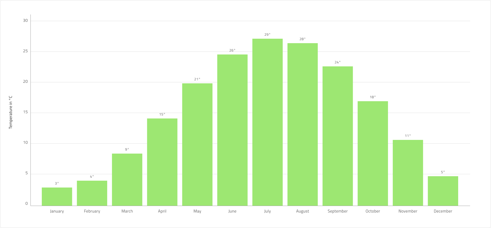
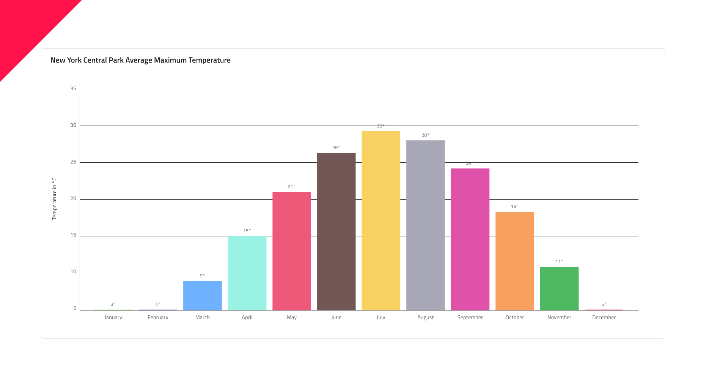

# Column Chart

 The Column Chart is among the most common chart types used to quickly compare frequency, count, total, or average of data in different categories with data encoded by vertical bars of equal width and differing heights. They are ideal for showing variations in the value of an item over time. Data is represented using a collection of rectangles that extend from the bottom to the top of the chart towards the values of data points. The Column Chart is visually identical to the [Ignite UI for Angular Column Chart Component](https://www.infragistics.com/products/ignite-ui-angular/angular/components/charts/types/column-chart.html)

## Column Chart Demo

The Column Chart comprises of a `Title`, a `Legend` that is hidden by default, and a `Chart Area` available in Idle and Hover states.

## Title

The Column Chart has a title that can be changed or hidden if not needed. In Figma you can hide the title by switching off the `Title` boolean property and thanks to the auto layout feature, the chart's layout will adjust itself accordingly.

## State

The Column Chart has two states - Idle and Hover. In Figma you can switch between the two states by selecting the nested Chart Area component from the layers panel and switching on/off the boolean property `Hover Tooltip` from the properties panel. In the Hover state a tooltip is shown upon hovering over a data point, which is then focused and the other columns are dimmed out.

## Y-Axis

The Y-axis of the column chart comprises of a Title, Labels, and the Axis itself. The Title and the Labels are configurable and you can hide a label by simply selecting and hiding it from the layers panel in Figma. You may hide the axis line by setting its color to `Transparent`, and to hide all elements at once, hide the nested Y axis component from the layers panel in Figma.

## Gridlines

The Column Chart has built-in Gridlines to make it easier to visually trace a data point to a value on the Y-axis. In Figma you can show/hide them by selecting the nested Chart Area component and switching on/off the boolean property `Gridlines` from the properties panel.

## Data Points

Data Points for a Column Chart are the individual columns, arranged in an auto layout in Figma, making it possible to effortlessly adjust their amount on the Chart Area. In Figma you can easily ajdust the columns' height by selecting the Column height frame and adjusting the vertical spacing between the items from the properties panel. Furthermore, the columns come with configurable labels on the X-axis and annotation labels.

## Styling

First and foremost, the Column Chart lets you change the color of the series. It is recommended to use only colors from the palette for data visualizations with nuances named series.1, series.2 and so on till series.10. You may also change the colors of the vertical and horizontal axis, the gridlines, as well as the chart area background and border colors. Titles, labels, annotation values etc. are also customizable via the available text styles in the **Indigo.Design System**.

## Usage

Use the Column Chart when you want to show the amount of change over a period of time. Always start your numeric Axis at 0 to avoid misrepresenting the data. Also, avoid using different colors for the same category. If referencing time, e.g. dates or months, to represent the change in the category, you should always set it on the horizontal axis. Use subtle colors for the Gridlines to make the chart easier on the eye. If you need a more detailed time series visual, consider using a Line Chart instead.

| Do                                                                                             | Don't                                                                                              |
| ---------------------------------------------------------------------------------------------- | -------------------------------------------------------------------------------------------------- |
|  |  |

## Additional Resources

Related topic:

- [Line Chart](line-chart.md)
- [Spline Chart](spline-chart.md)
- [Step Chart](step-chart.md)
- [Pie Chart](pie-chart.md)
- [Skeleton Charts](skeleton-charts.md)
  

Our community is active and always welcoming to new ideas.
