# Combo

Use the Combo Component to let the user select one or more items from a collection that is displayed upon user interaction in a scrollable list. In case you want to costrain the selection to a single item only, you should use the [Dropdown](dropdown.md) instead. The Combo is visually identical to the [Ignite UI for Angular Combo Component](https://www.infragistics.com/products/ignite-ui-angular/angular/components/combo.html)

## Combo Demo

The Combo has two pieces: an input containing the current selection and a dropdown that is shown in order to select one or more items.

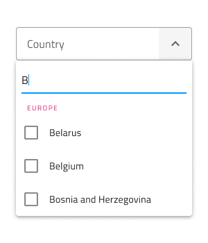

## Input Type

The Combo input provides selection between a line type for a more airy style, border type for a more structured perception on solid color backgrounds, and a boxed type that is most appropriate when placed on top of a vivid image to improve readability.

`line`

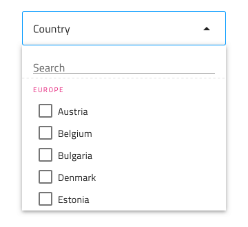
`border`

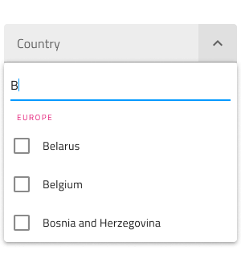
`box`

## Interaction State

Each of the three Combo input types can be inserted in an enabled or disabled state.

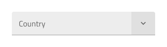
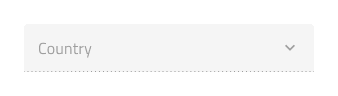

## Input Variant

The Combo input can be used styled in **dark** and light variants to assure good readability and contrast for both lighter and darker backgrounds.

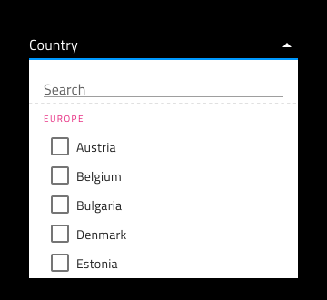

## State

When the user interacts with the Combo, its input goes through various selection states: **idle** with a placeholder in the place of the content, focused when the dropdown is open, filled once the user has finished with selection and moved on. These flexibility enhancements afford a more dynamic interaction design that can seamlessly flow into high-fidelity prototyping.

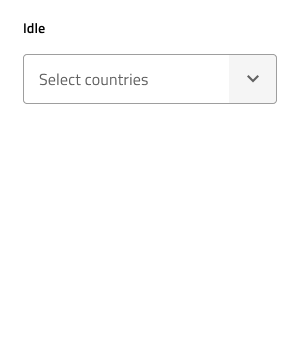
`idle`

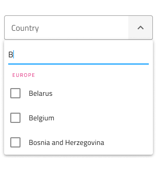
`focused`

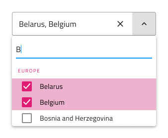
`filled`

Every experienced designer uses constraints wisely to limit the user input and avoid invalid states, hence the availability of validation styles. Through the available validation styles, the Combo is consistent with the standard [Input](input.md) and equipped for sophisticated designs that display success, warning, and error visuals.

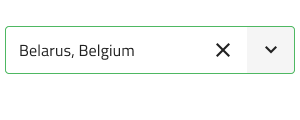
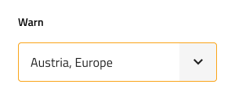
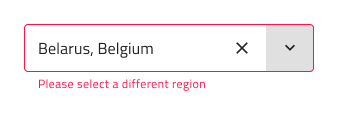

## Layout

The Combo input has only one layout option but to assure consistency with the standard [Input](input.md) this override has been preserved.

## Dropdown Type

The dropdown used for the Combo comes with the appropriate sizing for desktop and mobile use similarly to the normal [Dropdown](dropdown.md) component.

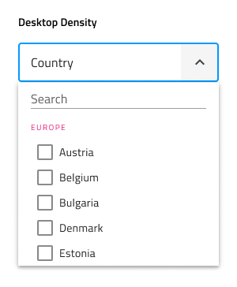
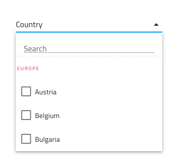

## Dropdown Search Input

The dropdown contains a Search Input that comes with dark and light variants, a selection of states, and options for layout akin to the standard [Input](input.md).

## Dropdown Items

The dropdown used for the Combo supports two types of items: header and multi-select item. Through headers, it is possible to organize items in groups. In Sketch, the dropdown uses a smart layout allowing it to adjust accordingly when one or more of its items are set to ~No Symbol, while in Adobe XD you have to delete the unused layers instead, and the layout will adjust through the use of stacks.

## Dropdown Item States

The dropdown items within the Combo support five different states: disabled, **idle**, focused, selected and selected&focused.

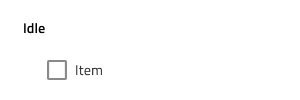

## Styling

The Combo comes with the combined styling flexibility of its input and dropdown pieces. There are overrides controlling the input text elements' color and bottom line style and color. For the dropdown one may change the background color, or use the various overrides related to the items in the Combo dropdown, such as the search input and the items with their background and text colors.

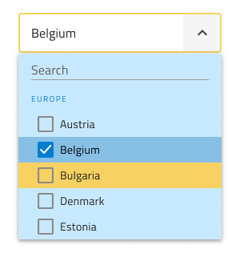

## Usage

When using the Combo, its input and dropdown should have the same width and their left and right borders should match. Regarding how the dropdown is shown when the Combo is focused, you should always show it on top of the content that follows the Combo triggering its display. Combos don't push content like expansion panels do.

| Do                                                                           | Don't                                                                            |
| ---------------------------------------------------------------------------- | -------------------------------------------------------------------------------- |
| 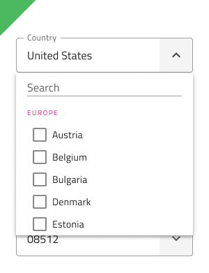 | 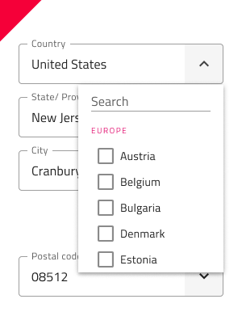 |
| 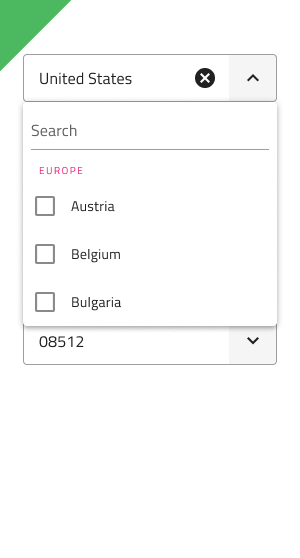 | 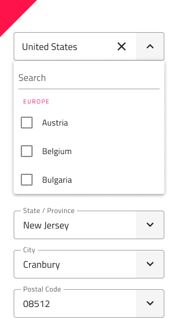 |

## Additional Resources

Related topics:

- [Dropdown](dropdown.md)
- [Form Pattern](../patterns/form.md)
- [Input](input.md)
  

Our community is active and always welcoming to new ideas.

