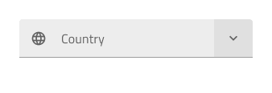
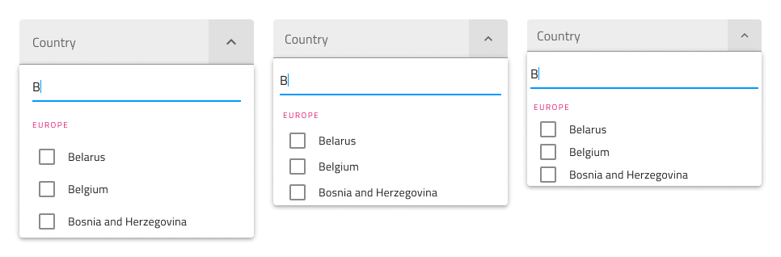
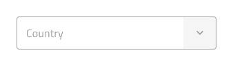
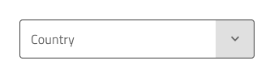
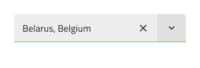
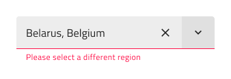
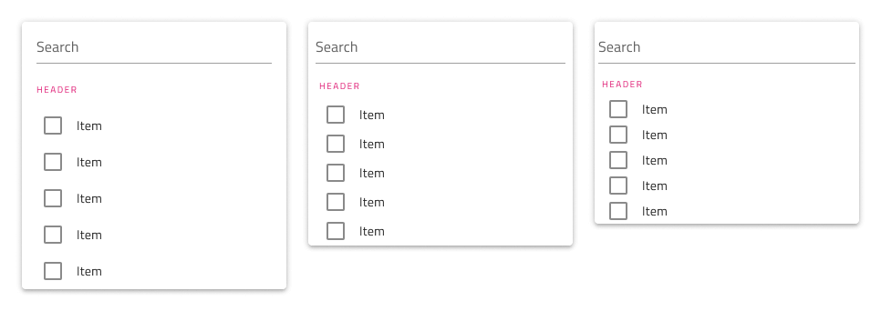
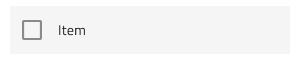

# Combo

Use the Combo component to allow users to select an option from a predefined list of choices or enter their own value. When the user clicks on the arrow down icon, a Dropdown list of options is displayed, and they can select one or more of the options, search for a value, or type their own value into the text box. The Combo is visually identical to the [ Ignite UI for Angular Combobox Component](https://www.infragistics.com/products/ignite-ui-angular/angular/components/combo.html)

> [!Note]
> The Combo has two layout options: Combo with Multiple Select `(Combo)` and [Single Select Combo (Simple Combo) ](simple-combo.md)

## Combo Demo

The Combo has two pieces: an Input containing the current selection or a placeholder, and a Dropdown that is shown in order to select one or more items.

## Combo Input Type

The Combo Input in Figma provides selection between border type for a more structured perception on solid color backgrounds, and a boxed type that is most appropriate when placed on top of a vivid image to improve readability.

| Border | Box |
| ------- | ------- |
|  |  |

The Combo Input has a Prefix container which can be switched **on** and **off** through the `Prefix Container` boolean property. Label and Hint could also be switched **on** or **off** through their boolean properties.

| With Prefix | With Label | With Hint | 
| ------- | ------- | ------- |
|  |  |  |
|  |  |  |

## Size

The Combo is available in three sizes:
- Large
- Medium
- Small

The Dropdown automatically adjusts its dimensions to match the selected size variant.

## Interaction State

Each of the two Combo Input types can be inserted in an **enabled** or **disabled** state. The available border and box types in Figma can be switched to a disabled state from the properties panel.

## State

When the user interacts with the Combo, its input goes through various selection states: **Idle** with a placeholder in the place of the content, **Hover** which changes visually on mouse over,  **Focused** when the Dropdown is open and the Search is **Focused**, **Filled** once the user has finished with selection and moved on. These flexibility enhancements afford a more dynamic interaction design that can seamlessly flow into high-fidelity prototyping.

| Idle | Hover | Focused | Filled | 
| ------- | ------- | ------- | ------- |
|  |  |  |  |

Every experienced designer uses constraints wisely to limit the user input and avoid invalid states, hence the availability of validation styles. Through the available validation styles, the Combo Input is consistent with the standard [Input](input.md) and equipped for sophisticated designs that display success, warning, and error visuals.

| Success | Warning | Error | 
| ------- | ------- | ------- |
|  |  |  |
|  |  |  |

In Figma changing the states is achieved via the properties panel.

## Dropdown Size

The Dropdown used for the Combo comes with the appropriate sizing for Large, Medium and Small Combo similarly to the normal [Dropdown](dropdown.md) component. The Combo Dropdown can be switched **on** and **off** from a boolean property which can visually affect the input, but this is an expected behaviour.

## Dropdown Search Input

In Figma the Dropdown contains a Search Input that comes with a selection of states and options for layout akin to the standard [Input](input.md).

## Dropdown Items

The Dropdown used for the Combo supports two types of items: header and multi-select item. Both are available in Large, Medium and Small sizes. Through headers, it is possible to organize items in groups. In Figma, the Dropdown utilizes the auto layout option, which adjusts the layout, once one or more items get hidden from the layers panel.

## Dropdown Item States

The Dropdown items within the Combo support three different states: **Idle**, **Hover** and **Focused**. **Disabled** and **Selected** states can be switched on and off from boolean properties.

|  | Idle | Hover | Focused | Disabled |
|  | ---- | ----- | ------- | -------- |
|  |  |  |  |  |
| Selected |  |  |  |  |

## Styling

The Combo comes with the combined styling flexibility of its input and dropdown pieces. There are options for the input text elements' color and bottom line style and color. For the dropdown one may change the background color, or use the various options related to the items in the Combo Dropdown, such as the Search Input and the items with their background and text colors.

## Usage

When using the Combo, its input and dropdown should have the same width and their left and right borders should match. Regarding how the dropdown is shown when the Combo is focused, you should always show it on top of the content that follows the Combo triggering its display. Combos don't push content like expansion panels do.

| Do                                                                           | Don't                                                                            |
| ---------------------------------------------------------------------------- | -------------------------------------------------------------------------------- |
|  |  |
|  |  |

## Additional Resources

Related topics:

- [Dropdown](dropdown.md)
- [Form Pattern](../patterns/form.md)
- [Input](input.md)
- [Simple Combo](simple-combo.md)
  

Our community is active and always welcoming to new ideas.
