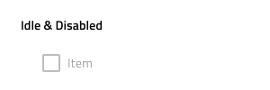

# Combo

Use the Combo Component is used to allow users to select an option from a predefined list of choices or enter their own value. When the user clicks on the drop-down arrow, a drop down list of options is displayed, and they can either select one of the options or type their own value into the text box. The Combo is visually identical to the [Ignite UI for Angular Combo Component](https://www.infragistics.com/products/ignite-ui-angular/angular/components/combo.html)

## Combo Demo

The Combo has two pieces: an input containing the current selection and a drop down that is shown in order to select one or more items.

## Combo Input Type

The Combo provides selection between a border type for a more structured perception on solid color backgrounds, and a boxed type that is most appropriate when placed on top of a vivid image to improve readability.

## Enabled and Disabled States

Each of the two Combo input types can be inserted in an enabled or disabled state. In Figma the input can be disabled from the property panel.

## States

When the user interacts with the Combo, its input goes through various selection states: **Idle** with a placeholder in the place of the content, **Focused** when the drop down is open, **Filled** once the user has finished with selection and moved on. These flexibility enhancements afford a more dynamic interaction design that can seamlessly flow into high-fidelity prototyping.

Every experienced designer uses constraints wisely to limit the user input and avoid invalid states, hence the availability of validation styles. Through the available validation styles, the Combo is consistent with the standard [Input](input.md) and equipped for sophisticated designs that display success, warning, and error visuals.

In Sketch, the states and validation states are achieved with `Symbol Overrides`, while in Figma and Adobe XD we are using the `Component States` paradigm to let you easily switch between them.

> [!Note]
> The Combo input has only one layout option, but this override has been preserved in Sketch to ensure consistency with the standard [Input](input.md).

## Drop down Type

The dropdown used for the Combo comes with the appropriate sizing for desktop and mobile use similarly to the normal [Dropdown](dropdown.md) component.

## Dropdown Search Input

The dropdown contains a Search Input that comes with a selection of states and options for layout akin to the standard [Input](input.md).

## Drop down Items

The dropdown used for the Combo supports two types of items: header and multi-select item. Through headers, it is possible to organize items in groups. In Figma, the Drop down utilizes the auto layout option, which makes sure all items are placed accordingly one to another, once you hide or add one or more items. In Sketch, the dropdown uses a smart layout allowing it to adjust accordingly when one or more of its items are set to ~No Symbol. In Adobe XD you should delete the unnecessary ones, and the layout will adjust through the use of a Stack.

## Dropdown Item States

The dropdown items within the Combo support six different states: **Idle**, **Idle & Disabled**, **Disabled**, **Selected**, **Selected & Focused**, **Focused**

## Styling

The Combo comes with the combined styling flexibility of its input and drop down pieces. There are options for the input text elements' color and bottom line style and color. For the dropdown one may change the background color, or use the various options related to the items in the Combo drop down, such as the search input and the items with their background and text colors.

## Usage

When using the Combo, its input and dropdown should have the same width and their left and right borders should match. Regarding how the dropdown is shown when the Combo is focused, you should always show it on top of the content that follows the Combo triggering its display. Combos don't push content like expansion panels do.

| Do                                                                           | Don't                                                                            |
| ---------------------------------------------------------------------------- | -------------------------------------------------------------------------------- |
|  |  |
|  |  |

## Additional Resources

Related topics:

- [Dropdown](dropdown.md)
- [Form Pattern](../patterns/form.md)
- [Input](input.md)
  

Our community is active and always welcoming to new ideas.
