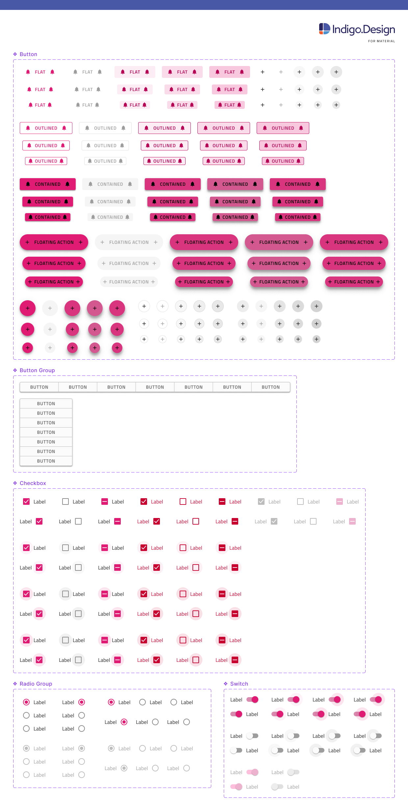
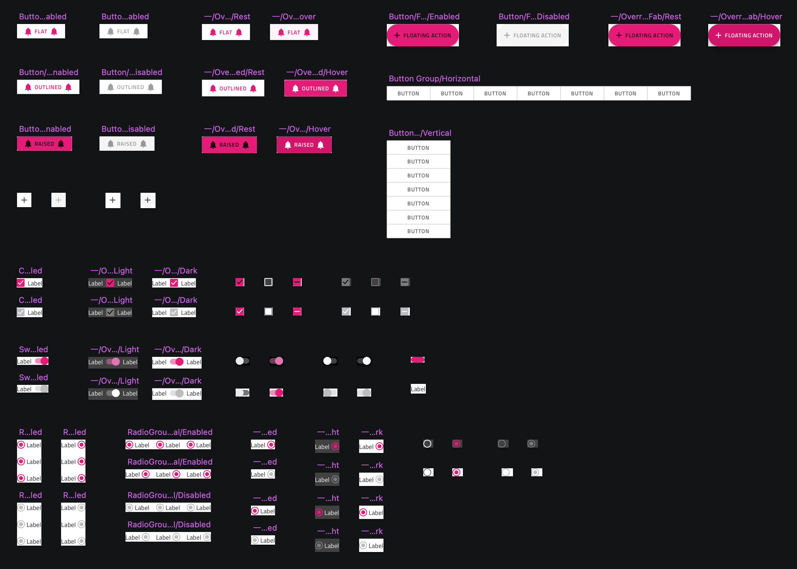
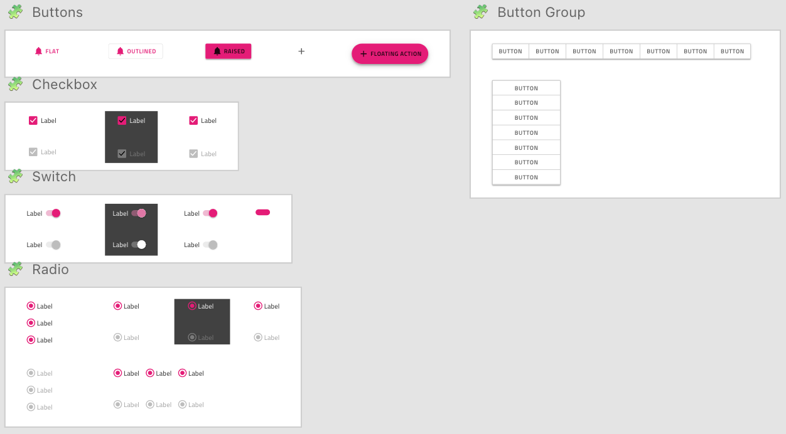

# Components Overview

The **Indigo.Design System** empowers your design workflow with 60+ UI Components that also map to Ignite UI for Angular controls. Most components are optimized for responsive web design and development, providing various templating capabilities through Auto Layout in Figma (Smart Layout in Sketch) and resizing rules. In Adobe XD, we have extended this through the use of Stacks and Repeat Grids, but have also added various interaction states to choose from when designing interactive experiences. All this streamlines application design and development allowing a huge variety of user interface scenarios to be created with the libraries and subsequently through code generation become available as Ignite UI for Angular code.

> [!WARNING]
> To ensure the proper usage of components from the **Indigo.Design System** libraries and avoid potential issues, it is recommended not to place the following items on artboards and frames:
> - Symbols and components designated as `_Overrides` (**Sketch** and **Adobe XD**)
> - `Base components`(**Figma**)
>
> These elements do not have component states and are not considered as complete components.

## Figma

Within the Figma libraries, there is a page named `🧩 Components`, under which is a list of all the components included in the kit. Each component has its page, where all the relevant base components are located. Once you make a library available in your design file, you can easily access its assets from the sidebars and drag components into the canvas from the Assets panel in the left sidebar. After placing a component in the workspace and selecting it, you can view its available properties in the right sidebar, and even swap instances directly from there. Below you may see some of the Components such as the different types of [Buttons](button.md), [Button Group](button-group.md) and form elements like [Checkbox](checkbox.md), [Switch](switch.md), and [Radio Group](radio-group.md).

## Sketch

The Sketch libraries have a `🧩 Components` page containing all Components and symbols related to them. When selecting a Symbol instance, through the Override section in the right panel, one can change the content inside e.g. enabled/disabled states, icons, colors, etc. Below is a small part of showing some of the Components and symbols such as the different types of [Buttons](button.md), [Button Group](button-group.md) and form elements like [Checkbox](checkbox.md), [Switch](switch.md), and [Radio Group](radio-group.md).

## Adobe XD

In the Adobe XD library you can find the `🧩 Components` in the middle column. Here, the various states of a component can be switched from the right panel. Also, we have used the `Stack` and `Padding` to align and distribute elements vertically or horizontally and change their position. When you want to swap a nested component with another one, you can simply drag it from the `Libraries` panel and drop it on top of the current one to replace it. You will also notice that some components, such as the Grid, for example, use a `Repeat Grid` to speed configuration up. Below you may find some of the Components like different types of [Buttons](button.md), [Button Group](button-group.md) and form elements such as [Checkbox](checkbox.md), [Switch](switch.md), and [Radio Group](radio-group.md).

> [!WARNING]
> Detaching a component from the library in Sketch makes it impossible to automatically apply updates from subsequent versions of the Design System and may impact the code generation capability of the component. The code generation services rely on specially designated `🚫 metadata` layers containing metadata descriptions of the state, template, and other properties of the component. In Figma libraries, there is one additional layer placed in every component named `🚫 componentVersion` containing the version, which helps for successful code generation.
>
> Ungrouping a component or pattern from the Adobe XD library has even worse implications because it turns all nested components into groups and breaks the code generation service for the component as it cannot trace correctly its structure. You can make any state, layout and styling adjustment in Adobe XD without ungrouping a component so we kindly advise you to keep the entirety of the components on your artboards.

All **Indigo.Design System** Components are built on top of rigid [styling foundations](../style/styling-overview.md) letting you leverage an elaborate mechanism for theming and branding your user interface.

> [!WARNING]
> When changing an icon glyph with another one by dragging it from the `Libraries` panel in Adobe XD, sometimes its layer name will change from `🔣 Icon` to the symbol name `_Overrides/~`. When this happens you must rename it back to the original layer name before the element got swapped to assure successful code generation.

## Additional Resources

Related topics:

- [Styling](../style/styling-overview.md)
- [Patterns](../patterns/patterns-overview.md)
  

Our community is active and always welcoming to new ideas.
