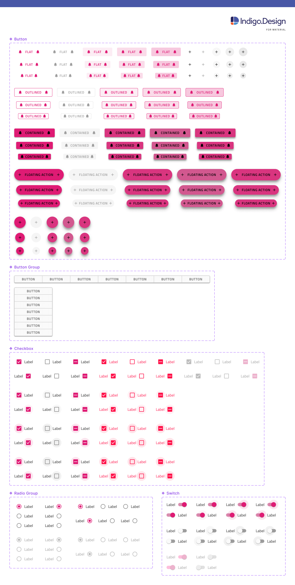

# Components Overview

The **Indigo.Design System** empowers your design workflow with 60+ UI Components that also map to Ignite UI for Angular controls. Most components are optimized for responsive web design and development, providing various templating capabilities through Auto Layout in Figma and resizing rules. All this streamlines application design and development allowing a huge variety of user interface scenarios to be created with the libraries and subsequently through code generation become available as Ignite UI for Angular code.

> [!WARNING]
> To ensure the proper usage of components from the **Indigo.Design System** libraries and avoid potential issues, it is recommended not to place the `Base Components` on artboards and frames in Figma.
> These elements do not have component states and are not considered as complete components.

## Figma

Within the Figma libraries, there is a page named `🧩 Components`, under which is a list of all the components included in the kit. Each component has its page, where all the relevant `Base Components` are located. Once you make a library available in your design file, you can easily access its assets from the sidebars and drag components into the canvas from the Assets panel in the left sidebar. After placing a component in the workspace and selecting it, you can view its available properties in the right sidebar, and even swap instances directly from there. Below you may see some of the Components such as the different types of [Buttons](button.md), [Button Group](button-group.md) and form elements like [Checkbox](checkbox.md), [Switch](switch.md), and [Radio Group](radio-group.md).

> [!WARNING]
> Detaching a component from the library in Figma makes it impossible to automatically apply updates from subsequent versions of the Design System and may impact the code generation capability of the component. The code generation services rely on specially designated `🚫 metadata` layers containing metadata descriptions of the state, template, and other properties of the component. There is also one additional layer placed in every component named `🚫 componentVersion` containing the version, which helps for successful code generation.

All **Indigo.Design System** Components are built on top of rigid [styling foundations](../style/styling-overview.md) letting you leverage an elaborate mechanism for theming and branding your user interface.

## Additional Resources

Related topics:

- [Styling](../style/styling-overview.md)
- [Patterns](../patterns/patterns-overview.md)
  

Our community is active and always welcoming to new ideas.
