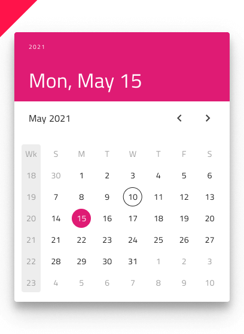

# Date Picker

Use the Date Picker Component to represent a date visually and provide appropriate means for its display in forms and selection from a drop-down or dialog. The Date Picker is visually identical to the [Ignite UI for Angular Date Picker Component](https://www.infragistics.com/products/ignite-ui-angular/angular/components/date_picker.html)

## Date Picker Demo

## Date Picker Input

You may insert a Date Picker Input in your forms to indicate fields for selecting a date. It supports Enabled and Disabled interactive states, as well as variant for Dialog and Drop-down that will be shown upon user interaction.

## Picker Layout

The Date Picker supports Dialog layout with Horizontal and Vertical orientation, as well as a Drop-down layout to facilitate different modes of picking dates, casting different shadows to be more easily distinguished from each other. Notice that Dialog layouts come with a Header that you may hide in Sketch by setting its override to ~No Symbol, and through the use of a smart layout everything will adjust accordingly. In Adobe XD, you have to delete the header layer and the layout will adjust through the use of a Stack.

## Week Start

The start of the week can also be chosen as an option at the time of inserting a Date Picker between the two most common scenarios for first day of the week: Sunday and Monday.

## Week Numbers

The Date Picker has the same built-in support for Week Numbers like the Calendar. If you prefer not to show this part of the UI, simply set the Week Numbers override to ~No Symbol in Sketch, and through the use of smart layout, it will adjust accordingly, while in Adobe XD you have to delete the unused layer instead, and the layout will adjust through the use of stacks.

## Selection

Akin to the Calendar, the Date Picker lets you pick between three selection modes: **Single Day** limiting the user to be able to select only one date, Multiple Days allowing selection of random dates, and Range providing means to select all dates between a start and end date.

## Buttons

The Drop-down Date Picker comes with two buttons: one for closing in and keeping the current selection, and one for navigating to today. The Button area is templatable, allowing you, for example, to hide a button. To hide a button in Sketch, you have to set its override to ~No Symbol, and through the use of a smart layout, it will adjust accordingly. While in Adobe XD, you have to delete the unused layer instead, and the layout will adjust through the use of stacks. The Dialog Date Picker comes with no buttons by default because upon selecting a date, the dialog closes automatically.

## Styling

The Time Picker comes with styling flexibility through the various options for header background and title colors, as well as text colors for the selected hour, minute, and meridiem (AM/PM). The Cancel and OK buttons are [Flat Buttons](button.md) and can be styled accordingly.

## Usage

Show the Horizontal and Vertical Time Pickers as a dialog that dims the rest of the UI.

| Do                                                                                     | Don't                                                                                      |
| -------------------------------------------------------------------------------------- | ------------------------------------------------------------------------------------------ |
|  |  |
|  |  |

## Additional Resources

Related topics:

- [Calendar](calendar.md)
- [Input](input.md)
- [Time Picker](time-picker.md)
- [Form Pattern](../patterns/form.md)
  

Our community is active and always welcoming to new ideas.
