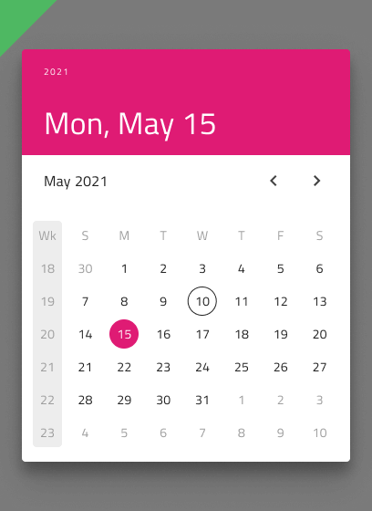

# Date Picker

Use the Date Picker Component to represent a date visually and provide appropriate means for its display in forms and selection from a dropdown or dialog. The Date Picker is visually identical to the [Ignite UI for Angular Date Picker Component](https://www.infragistics.com/products/ignite-ui-angular/angular/components/date_picker.html)

## Date Picker Demo

## Date Picker Input

You may insert a Date Picker Input in your forms to indicate fields for selecting a date. It supports Enabled and Disabled interactive states, as well as variant for Dialog and Dropdown that will be shown upon user interaction.

## Picker Layout

The Date Picker supports a Dialog layout with Horizontal and Vertical orientation, as well as a Dropdown layout to facilitate different modes of picking dates, casting different shadows to be more easily distinguished from each other. Notice that Dialog layouts come with a Header that you may hide in Figma by switching off the boolean `Header` property and the layout will adjust itself accordingly thanks to the added auto layout. In Sketch you can achieve this by setting the Header's override to ~No Symbol, and through the use of a smart layout everything will adjust accordingly. In Adobe XD, you have to delete the header layer and the layout will adjust through the use of a Stack.

In Figma, you can display action buttons at the bottom of the date picker by enabling the `Action Buttons` boolean property.

## Multiview Variants

The Date Picker supports a Multiview option for showing two months side by side. In Figma you can switch it on using the `Multiview` boolean property and choose between horizontal and vertical orientation from the `Orientation` property. In Sketch and Adobe XD we have only horizontal multiview, and the orientation and the view should be chosen when inserting the component.

## Week Start

We support the two most common scenarios for first day of the week: Sunday and Monday. In Figma you can select the start of the week from the `Week Start` property. In Sketch and Adobe XD the starting day should be chosen as an option at the time of inserting a Date Picker.

## Week Numbers

The Date Picker has the same built-in support for Week Numbers as the Calendar. If you prefer not to show this part of the UI, simply switch off the boolean `Week Numbers` property in Figma and the layout will adjust itself accordingly thanks to the added auto layout. In Sketch this can be achieved by setting the Week Numbers override to ~No Symbol and through the use of smart layout, everything will adjust accordingly. In Adobe XD you have to delete the Week Numbers layer to achieve the same and the Stack used there will adjust the layout in a similar fashion.

## Selection

Akin to the Calendar, the Date Picker lets you pick between three selection modes: **Single Day** limiting the user to be able to select only one date, **Multiple Days** allowing selection of random dates, and **Range** providing means to select all dates between a start and end date.

## Styling

The Date Picker comes with styling flexibility through the various options for header background and title colors, as well as text colors for the selected date, current date etc.

## Usage

Show the Horizontal and Vertical Dialog Date Pickers as a dialog that dims the rest of the UI.

| Do                                                                                     | Don't                                                                                      |
| -------------------------------------------------------------------------------------- | ------------------------------------------------------------------------------------------ |
|  |  |
|  |  |

## Additional Resources

Related topics:

- [Calendar](calendar.md)
- [Input](input.md)
- [Time Picker](time-picker.md)
- [Form Pattern](../patterns/form.md)
  

Our community is active and always welcoming to new ideas.
