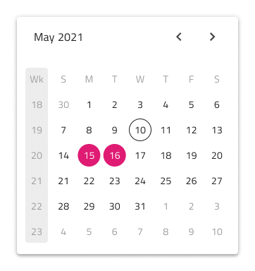
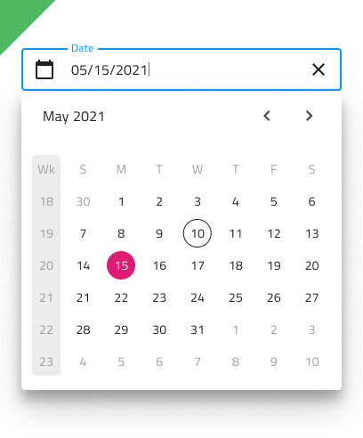

# Date Picker

Use the Date Picker Component to represent a date visually and provide appropriate means for its display in forms and selection from a dropdown or dialog. The Date Picker is visually identical to the [Ignite UI for Angular Date Picker Component](https://www.infragistics.com/products/ignite-ui-angular/angular/components/date_picker.html)

## Date Picker Demo

## Date Picker Type

In Figma the user has the option to select either a dialog or a dropdown Date Picker via the `Type` property in the property panel.

## Date Picker Sizing

All Date Picker types are available in three sizes:
- Large
- Medium
- Small

## Date Picker Input

You may insert a Date Picker Input in your forms to indicate fields for selecting a date. It supports variants for Dialog and Dropdown that will be shown upon user interaction.

## Date Picker Input Type

 In Figma the user can choose between two distinct Date Picker Input types: border style for a more structured perception on solid color backgrounds and boxed style which is most appropriate when the component is placed on top of a vivid image to improve the readability of its content.

## Date Picker Input Sizing

All Date Picker input types come in three sizes in order to match the corresponding sizes of the Date Picker component:
- Large
- Medium
- Small

## Date Picker Input States

The Date Picker input supports seven user interaction states: **Idle**, **Idle & Hover**, **Idle & Disabled**, **Filled**, **Filled & Hover**, **Filled & Disabled** and **Focused**, along with three validation states: **Success**, **Warn** and **Error**.

## Date Picker Layout

The Date Picker supports a Dialog layout with Horizontal and Vertical orientation, as well as a Dropdown layout to facilitate different modes of picking dates, casting different shadows to be more easily distinguished from each other. Notice that Dialog layouts come with a Header that you may hide in Figma by switching off the boolean `Header` property and the layout will adjust itself accordingly thanks to the added auto layout.

In Figma, you can display action buttons at the bottom of the Date Picker by enabling the `Action Buttons` boolean property.

## Multiview Variants

The Date Picker includes a Multiview option to display two months side by side. In Figma, you can enable this with the `Multiview` boolean property and select either horizontal or vertical orientation using the `Orientation` property.

## Week Start

We support the two most common scenarios for first day of the week: Sunday and Monday. In Figma you can select the start of the week from the `Week Start` property.

## Week Numbers

The Date Picker has the same built-in support for Week Numbers as the Calendar. If you prefer not to show this part of the UI, simply switch off the boolean `Week Numbers` property in Figma and the layout will adjust itself accordingly thanks to the added auto layout.

## Selection

Akin to the Calendar, the Date Picker lets you pick between three selection modes: **Single Day** limiting the user to be able to select only one date, **Multiple Days** allowing selection of random dates, and **Range** providing means to select all dates between a start and end date.

## Styling

The Date Picker comes with styling flexibility through the various options for header background and title colors, as well as text colors for the selected date, current date etc.

## Usage

As a good practice, dim the rest of the UI only when you use the  Dialog type Date Picker.

| Do                                                                                     | Don't                                                                                      |
| -------------------------------------------------------------------------------------- | ------------------------------------------------------------------------------------------ |
|  |  |
|  |  |

## Additional Resources

Related topics:

- [Calendar](calendar.md)
- [Input](input.md)
- [Time Picker](time-picker.md)
- [Form Pattern](../patterns/form.md)
  

Our community is active and always welcoming to new ideas.
