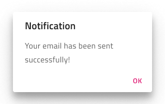
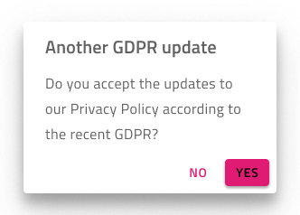

## Dialog

Use the Dialog Component to show a message or alert to the user, allowing him to take action accordingly or to present a form that requires immediate action before proceeding, such as a login. The Dialog is displayed modally, meaning that the user has to complete or close it before moving on. The Dialog is visually identical to the [Ignite UI for Angular Dialog Window Component](https://www.infragistics.com/products/ignite-ui-angular/angular/components/dialog.html)

### Dialog Demo


### Types

The Dialog can be used to show an alert with only a confirming button, a message with cancellation and confirmation, or as a container for action that needs immediate attention, such as a user logging into his account.




### Styling

The Dialog comes with styling flexibility through the various overrides for its title and message, as well as the buttons at the bottom that individually styled as flat or raised with all the styling options that these two [Button](button.md) types provide.



## Usage

When designing a custom content Dialog, avoid placing buttons in the content section and use the existing dialog buttons for your actions instead.

| Do                            | Don't                           |
| ----------------------------- | ------------------------------- |
|  |  |

## Code Generation

When colors or fonts are specified for the Dialog, the Dialog HTML element will be wrapped in a div. This is required by browsers to style a nested component (a component within another component). Currently changing of the button background color, button text style isn’t supported.

> [!WARNING]
> Triggering `Detach from Symbol` on an instance of the Dialog in your design is very likely to result in loss of code generation capability for the Dialog.

### Data Bindings

Data bindings are specified by using curly brace syntax, example: {isAdmin}. Text fields (not `🕹️DataProperty` or `🕹️DataSource`) also support string interpolation syntax example: Admin: {isAdmin}. Data bindings can be non-nested or nested. If the target property is a nested property, include the nested property chain, but don’t include the model object name. Examples:

#### Not Nested

```typescript
Customer {
  imageName: String;
}
```

DataProperty would be: `{imageName}`

#### Nested

```typescript
Profile {
  imageName: String;
}

Customer {
  profile: Profile;
}
```

DataProperty would be: `{profile.imageName}`

### Text

There are four Text properties for the Dialog, Title, Message, Left Button, and Right Button. These properties may contain text, binding, or a combination of the two, examples:

- Settings
- {settingsLabel}
- Important {labelText}

### Dialog Naming

Dialog components are hidden at runtime until code opens them. The code generator uses the name given to the dialog in Sketch, to assign a name to the dialog in the HTML. For example, if the dialog was named: Dialog (will be changed to lower case) in Sketch the below bold #dialog will be added to the tag.

<igx-dialog **#dialog**

### Dialog Cancel Button

The code generator will add standard cancel button code to the HTML if no `🕹️Event` is specified for the LEFT button and the LEFT button text is Cancel (case insensitive comparison). In the below example, the name of the dialog was Dialog, the following will be added to the dialog HTML.

(onLeftButtonSelect)="dialog.close()"

### Buttons

There are Left and Right buttons. Each Button has a Type field that can be set Flat or Raised. Currently Text Style and Background on the Buttons are ignored.

### Button Event

Each button has an `🕹️Event` property. If supplied, onLeftButtonSelect and onRightButtonSelect events are outputted when the corresponding button is rendered. Additionally, the JavaScript $event argument will be added to the HTML signature and TypeScript method signature.

## Additional Resources

Related topics:

  <div class="divider--half"></div>

Our community is active and always welcoming to new ideas.

- [Indigo Design **GitHub**](https://github.com/IgniteUI/design-system-docfx)
