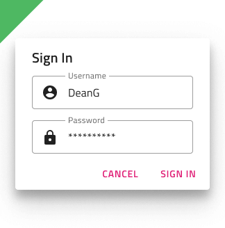

# Dialog

Use the Dialog Component to show a message or alert to the user, allowing him to take action accordingly or to present a form that requires immediate action before proceeding, such as a login. The Dialog is displayed modally, meaning that the user has to complete or close it before moving on. The Dialog is visually identical to the [Ignite UI for Angular Dialog Window Component](https://www.infragistics.com/products/ignite-ui-angular/angular/components/dialog.html)

## Dialog Demo

## Types

The Dialog can be used to show an alert with only a confirming button, a message with cancellation and confirmation, or as a container for action that needs immediate attention, such as a user logging into his account. Its Button area is templatable, allowing you, for example, to adjust the buttons. To hide one in Sketch, you have to set its main override to ~No Symbol, and thanks to the smart layout the area will adjust accordingly. In Adobe XD, to achieve the same, you should simply delete the unnecessary button and the Stack will adjust the area layout, however, it is also possible to insert another one unlike in Sketch. In Figma, in order to hide one of the two action buttons, you need to do that from the layers panel and the auto layout will adjust the area automatically.

## Styling

The Dialog comes with styling flexibility through the various options for its title and message, the buttons at the bottom with all the styling options that [Button](button.md) component provides, as well as the background and elevation.

## Usage

When designing a custom Dialog, avoid placing buttons in the body section and use the existing dialog buttons for your actions instead.

| Do                            | Don't                           |
| ----------------------------- | ------------------------------- |
|  |  |

## Additional Resources

Related topics:

- [Button](button.md)
  

Our community is active and always welcoming to new ideas.
