# Dropdown

Use the Dropdown Component to let the user select an item from a collection that is displayed upon user interaction in a scrollable list. Only one item can be selected at a time and if your scenario requires the selection of multiple items, you should use the [Combo](combo.md) instead. The Dropdown is visually identical to the [Ignite UI for Angular Dropdown Component](https://www.infragistics.com/products/ignite-ui-angular/angular/components/drop_down.html)

## Dropdown Demo

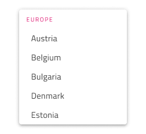

## Size

The Dropdown comes in three sizes: Large, Medium, and Small.

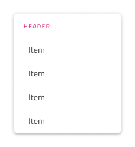
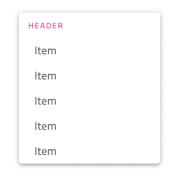
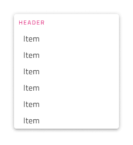

## Items

The Dropdown supports two types of items: header and item. Through headers it is possible to organize the other items in groups.

## Item States

The Dropdown items support five different states: **Idle**, **Disabled**, **Focused**, **Selected** and **Selected & Focused**. In Figma the states are different variants that can be achieved by changing the `State` property and/or the boolean properties for selected and disabled. In Sketch this is achieved with `Symbol Overrides`, while in Adobe XD we are using the `Component States` paradigm to let you easily switch between states.

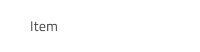

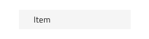
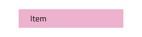
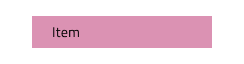

## Item Layout Template

The Dropdown Item supports flexible icon and label templating. In Sketch, to show the icon you have to set its override to Icon/Medium and the smart layout rules will adjust the item layout automatically. In Adobe XD, the same is possible by making the icon layer visible and leaving it to the Stack to adjust the layout automatically, however, if you don't need items with icons in the content, simply delete the icon layer. In Figma, we offer prefix and suffix icons, and to show them you have to select one or all items in your Dropdown and switch on the `Prefix Icon` and/or `Suffix Icon` property.

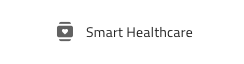 
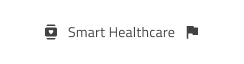 

## Styling

The Dropdown comes with styling flexibility for its background color, as well as various options related to the elements it contains such as item and header background and text colors.

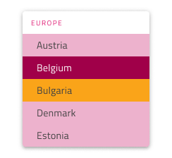

## Usage

When using the Dropdown you should always show it on top of the content that follows the item which triggers its display. Dropdowns don't push content like an expansion panel would.

| Do                                                                                 | Don't                                                                                  |
| ---------------------------------------------------------------------------------- | -------------------------------------------------------------------------------------- |
| 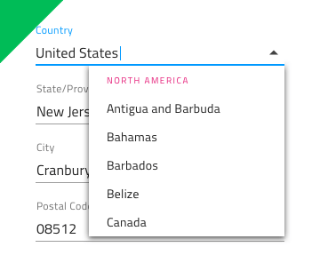 | 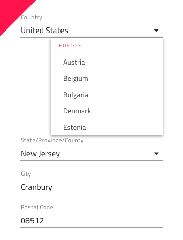 |

## Additional Resources

Related topics:

- [Combo](combo.md)
- [Select](select.md)
  

Our community is active and always welcoming to new ideas.
