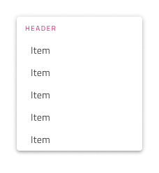
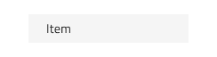

# Dropdown

Use the Dropdown Component to let the user select an item from a collection that is displayed upon user interaction in a scrollable list. Only one item can be selected at a time and if your scenario requires the selection of multiple items, you should use the [Combo](combo.md) instead. The Dropdown is visually identical to the [Ignite UI for Angular Dropdown Component](https://www.infragistics.com/products/ignite-ui-angular/angular/components/drop_down.html)

## Dropdown Demo

## Sizes

The Dropdown comes in three sizes: Large, Medium, and Small.

## Items

The Dropdown supports two types of items: header and item. Through headers it is possible to organize the other items in groups.

## Item States

The Dropdown items support seven different states: **Idle**, **Hover**, **Disabled**, **Focused**, **Selected**, **Selected & Hover** and **Selected & Focused**. In Figma the states are different variants that can be achieved by changing the `State` property and/or the boolean properties for Selected and Disabled.

## Item Layout Template

The Dropdown Item supports flexible icon and label templating. In Figma, you can add prefix and suffix icons to your Dropdown by selecting one or more items and enabling the `Prefix Icon` and/or `Suffix Icon` properties.

 
 

## Styling

The Dropdown comes with styling flexibility for its background color, as well as various options related to the elements it contains such as item and header background and text colors.

## Usage

When using the Dropdown you should always show it on top of the content that follows the item which triggers its display. Dropdowns don't push content like an expansion panel would.

| Do                                                                                 | Don't                                                                                  |
| ---------------------------------------------------------------------------------- | -------------------------------------------------------------------------------------- |
|  |  |

## Additional Resources

Related topics:

- [Combo](combo.md)
- [Select](select.md)
  

Our community is active and always welcoming to new ideas.
