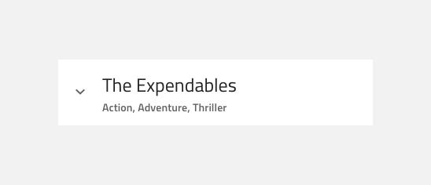
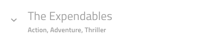
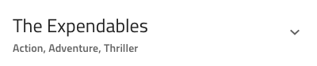
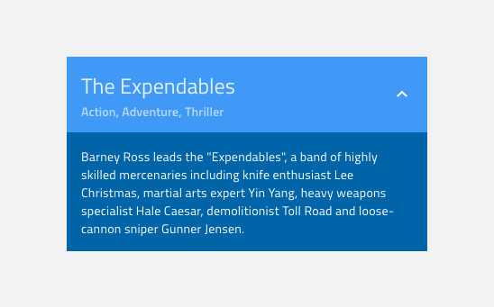
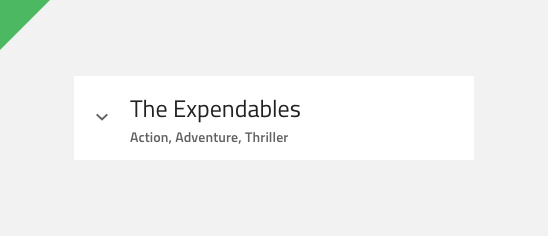
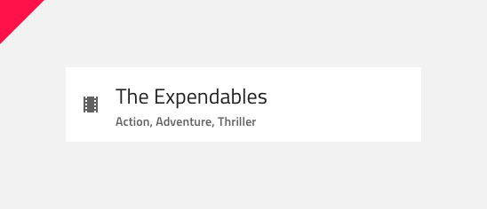

# Expansion Panel

Use the Expansion Panel Component as a way to preserve screen-space, where you have a lot of text and would like to hide it with the title in the Header giving initial information, and when opened, the Body's content giving more details. The Expansion Panel has two main states - Collapsed and Expanded.
The Expansion Panel is visually identical to the [Ignite UI for Angular Expansion Panel Component](https://www.infragistics.com/products/ignite-ui-angular/angular/components/expansion-panel.html)

## Expansion Panel Demo

## Header State

The Expansion Panel's Header comes in **Active** and Disabled state. You can switch between them using the Disabled boolean operation in Figma, using the Overrides panel in Sketch and from the States section in the right panel of Adobe XD.

`Active`

`Disabled`

## Header Layout

The Expansion Panel's Header Layout consists of Left Expansion Panel Icon, Content including Title and Description, and Right Expansion Panel Icon. In Figma there are Icon and Description properties, which let you modify the layout. By default the Right Expansion Panel Icon is set to ~No Symbol in Sketch and is hidden in Adobe XD. The Left Expansion Panel Icon and the Content are in a smart layout in Sketch and form a Stack in Adobe XD, meaning that if the Icon is hidden, the Content will automatically shift to the left. However, if you do so, remember to make the Right Expansion Panel Icon visible and set the left one to ~No Symbol in Sketch or delete it in Adobe XD.

## Body

The Expansion Panel's Body contains a text paragraph that is visible only in expanded state.

## Styling

The Expansion Panel comes with options for changing the both the Header's and Body's background colors, as well as text and icon colors.

## Usage

When using an Expansion Panel, make sure to use icons that give a proper idea of its usage, i.e. that there is more content available when the panel is expanded.

| Do                                                                             | Don't                                                                              |
| ------------------------------------------------------------------------------ | ---------------------------------------------------------------------------------- |
|  |  |

## Additional Resources

Related topics:

- [Icon](icon.md)
  

Our community is active and always welcoming to new ideas.
