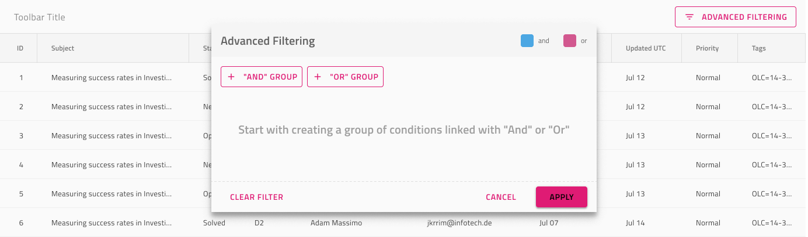

# Grid Advanced Filter

Use the Grid Advanced Filter to specify advanced filtering criteria spanning over multiple Grid columns via a dedicated dialog shown over the Grid. The Grid Advanced Filter is visually identical to [Ignite UI for Angular Grid Advanced Filtering Feature](https://www.infragistics.com/products/ignite-ui-angular/angular/components/grid/advanced-filtering.html)

## Grid Advanced Filter Demo

## Advanced Filter Feature

The Grid has three `Advanced Filtering` symbols under `Features`, one for each Display Density, that represent the overlay shown over the Grid.

## Filter Expression State

The Advanced Filter feature comes with an **Empty Filter** Expression by default that can be changed to Applied Filter if necessary and then customized further to specify desired filtering criteria.

## Toolbar

The Grid Advanced Filter is achieved by adding a Toolbar with an Advanced Filter action that enables the feature for the whole grid.

## Additional Resources

Related topics:

- [Grid](grid.md)
- [Grid Row Filter](grid-row-filter.md)
- [Grid Excel Style Filter](grid-excel-style-filter.md)
- [Grid Toolbar](grid-toolbar.md)
  

Our community is active and always welcoming to new ideas.
