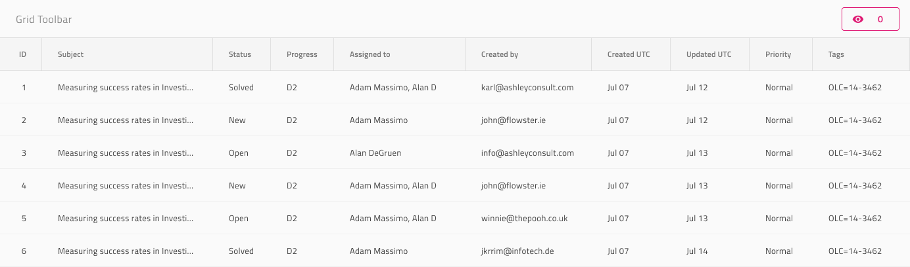

# Grid Column Hiding

Use the Grid Column Hiding to hide certain columns from the Grid. The easiest way to provide an interface for making columns visible again is by adding a Toolbar, which by default contains a button (combined with combo) that lets you configure the visibility of columns for the whole grid. The Grid Column Hiding is identical to the [Ignite UI for Angular Grid Column Hiding Feature](https://www.infragistics.com/products/ignite-ui-angular/angular/components/grid/column_hiding.html)

## Grid Column Hiding Demo

## Toolbar and Header Cell

The Grid Column Hiding can be achieved by adding a Toolbar with a Column Hiding action that enables the feature for the whole grid. However, in order to mark certain columns as hidable, you need to configure the `Column Hiding` override on the Grid Header Cell for the respective column in Sketch and set it to Hidden. In Adobe XD, the `Column Hiding` layer uses the `Component States` paradigm to let you easily switch between states. The default value is **Visible**. This feature has been deprecated in Figma and if you are using AppBuilder to generate your design, you should apply it directly there after the code generation.

## Additional Resources

Related topic:

- [Grid](grid.md)
- [Grid Toolbar](grid-toolbar.md)
  

Our community is active and always welcoming to new ideas.
