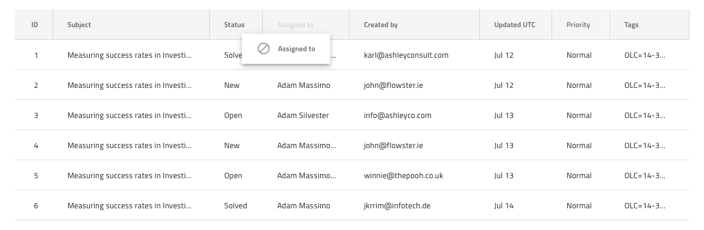

# Grid Column Moving

Use the Grid Column Moving to indicate that the columns of the Grid are movable and can be rearranged by dragging the Header Cell and dropping it to the desired location. The Grid Column Moving is visually identical to the [Ignite UI for Angular Grid Column Moving Feature](https://www.infragistics.com/products/ignite-ui-angular/angular/components/grid/column_moving.html)

## Grid Column Moving Demo

## Header Cell

In order to indicate that a column is movable, configure the `Column Moving` override of the Grid Header Cell for the column in Sketch by changing the default value from **Not Movable** to **Movable**. In Adobe XD, the `Column Moving` layer uses the `Component States` paradigm to let you easily switch between states. This is what marks the column as movable as far as code generation is concerned. This feature has been deprecated in Figma and should be applied directly in AppBuilder after the code generation.

## Column Moving Feature

The Grid has a `Column Moving` symbol/component under `Features` that represents the ghost Header Cell shown for the dragged column. It comes with presets for numeric and text columns. Adding this symbol/component has only a visual effect on your design to make it more realistic, if you want to switch the Column Moving feature, configure the Header Cells accordingly.

## Additional Resources

Related topic:

- [Grid](grid.md)
  

Our community is active and always welcoming to new ideas.
