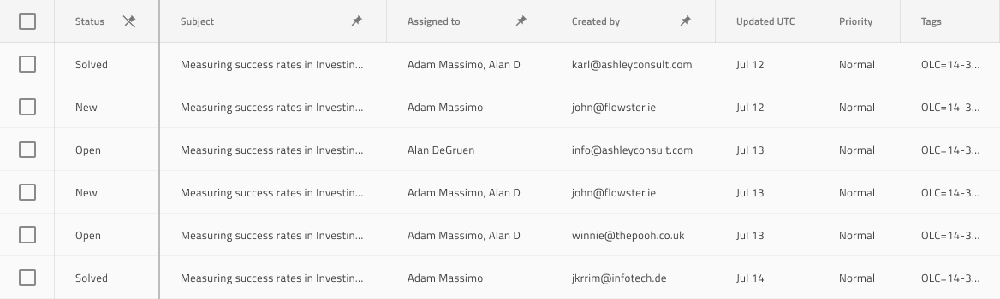

# Grid Column Pinning

Use the Grid Column Pinning as a mechanism to fix the first few columns of a scrollable Grid to the left. Now, when the user scrolls, all other columns move left and right except for the pinned ones. The pinned columns always appear on top of the scrollable ones. The Grid Column Pinning is visually identical to the [Ignite UI for Angular Grid Column Pinning Feature](https://www.infragistics.com/products/ignite-ui-angular/angular/components/grid_column_pinning.html)

## Grid Column Pinning Demo

## Header Cell Feature

To indicate a column as pinnable, use the `Column Pinning` override of the Grid Header Cell for that column in Sketch and change the default value from **Not Pinned** to **Pinned**. In Adobe XD, the `Column Pinning` layer uses the `Component States` paradigm to let you easily switch between states. This is what marks the column as pinnable as far as code generation is concerned. This feature has been deprecated in Figma and should be applied directly in AppBuilder after the code generation.

The Built-In Column Pinning can be used through the Grid's toolbar which by default contains a button (combined with a combo dropdown) that lets you configure the pin state of the columns for the whole grid.

## Custom Column Pinning

It is also possible to add a custom pinning action in the Grid Header Cell. In Sketch this can be achieved by using either the `Feature Left` or `Feature Right` overrides and setting it to `Icon Template`. This way an icon will appear to indicate the column is pinned and you can change its state from pin to unpin icon from Icon override. In Figma the method is identical, you need to go to the Header Cell layer, select either the `Feature Left` or `Feature Right` layer and change its `Type` property from `None` to `Icon Template`. Of course, you would probably also want to rearrange the column order so that the pinned ones come first when looking left to right.

## Cell Right Border

The right-most pinned column should have its `Right Border` override to indicate `Pinned Line` both for the Header and all Body Cells of the column. This is shown on the image below for all cells of the second column since Subject is pinned.

## Additional Resources

Related topic:

- [Grid](grid.md)
  

Our community is active and always welcoming to new ideas.
