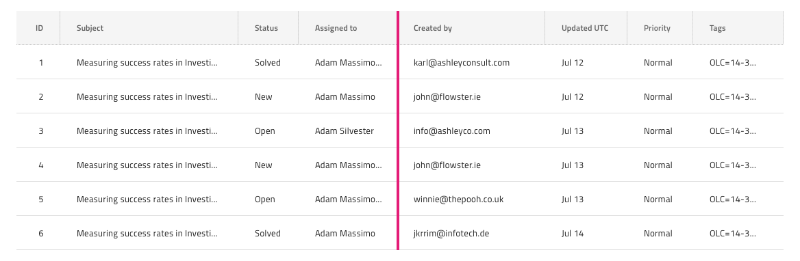

## Grid Column Resizing

Use the Grid Column Resizing to indicate that the columns of the Grid are resizable and allow the user to grab their header right border as a handle allowing to adjust their width. The Grid Column Resizing is visually identical to the [Ignite UI for Angular Grid Column Resizing Feature](https://www.infragistics.com/products/ignite-ui-angular/angular/components/grid/column_resizing.html)

### Grid Column Resizing Demo

### Header Cell

In order to indicate that a column is resizable, configure the `Column Resizing` override of the Grid Header Cell for the column by changing the default value from **Not Resizable** to Resizable.

### Column Resizing Indicator Feature

The Grid has a `Column Resizing Indicator` symbol under `Features` that represents a highlight border of the whole column where resizing occurs. Adding this symbol has only a visual effect on your design to make it appear more realistic, if you want to switch the Column Resizing feature, configure the Header Cells accordingly.

## Code generation

If the `Column Resizing Indicator` symbol is added make sure to place it within the group defining the Grid as a sibling to the Header and Body groups.

## Additional Resources

Related topic:

- [Grid](grid.md)
  

Our community is active and always welcoming to new ideas.
