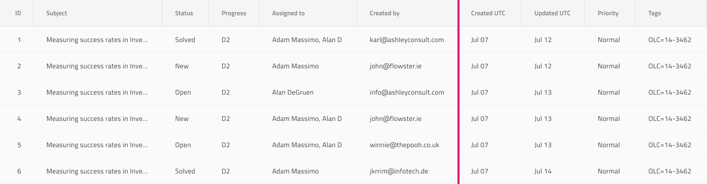

# Grid Column Resizing

Use the Grid Column Resizing to indicate that the columns of the Grid are resizable and allow the user to grab their header's right border as a handle to adjust their width. The Grid Column Resizing is visually identical to the [Ignite UI for Angular Grid Column Resizing Feature](https://www.infragistics.com/products/ignite-ui-angular/angular/components/grid/column_resizing.html)

## Grid Column Resizing Demo

## Header Cell

The Grid Column Resizing as a header cell feature has been deprecated in Figma and if you are using AppBuilder to generate your design, you should apply it directly there after the code generation.

## Column Resizing Indicator Feature

The Grid has a `Column Resizing Indicator` component in the `Base Components` that represents a highlight border of the whole column where resizing occurs. Adding this component has only a visual effect on your design to make it look more realistic.

## Additional Resources

Related topic:

- [Grid](grid.md)
  

Our community is active and always welcoming to new ideas.
