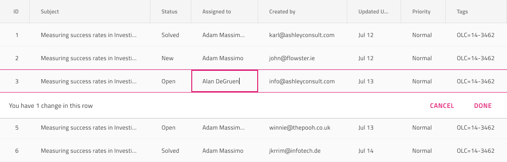

# Grid Editing

Use Grid Editing to allow the user to update certain values either cell by cell or one row at a time. Both Cell and Row Editing are visually identical to the [Ignite UI for Angular Grid Editing Feature](https://www.infragistics.com/products/ignite-ui-angular/angular/components/grid/editing.html)

## Cell Editing

The Grid Cell Editing happens cell by cell and is configured via the Body Cell that one wants to display in edit mode via the `Grid Feature` override in Sketch, or the `Grid Feature` component in Figma . In Adobe XD, the `Grid Feature` layer uses the `Component States` paradigm to provide a similar mechanism. Once you set the `Grid Feature` to `Cell Feature/Cell Editing`, you will have an editable Grid that respects this mode.

## Row Editing

The Grid Row Editing happens one row at a time and is configured via the Body Cells that belong to the edited row by setting their `Grid Feature` to `Cell Feature/Row Editing`. In Sketch, we introduce a second override `Editing State` allowing you to specify the cell in focus by setting it to `Focus Cell`, bear in mind that you should set all other cells on this row to `Rest Cell`. In Adobe XD both the above are available as `Component States` on the `Grid Feature` layer.

## Editing Row Banner

The Grid has an `Editing Row Banner` symbol under `Features` that represents a summary area with the number of edits made on the row and a pair of actions for canceling and confirming the edits made on the row. Adding this symbol/component has only a visual effect on your design to make it more realistic, if you want to switch the Row Editing feature, configure the Cells of the row accordingly.

## Additional Resources

Related topic:

- [Grid](grid.md)
  

Our community is active and always welcoming to new ideas.
