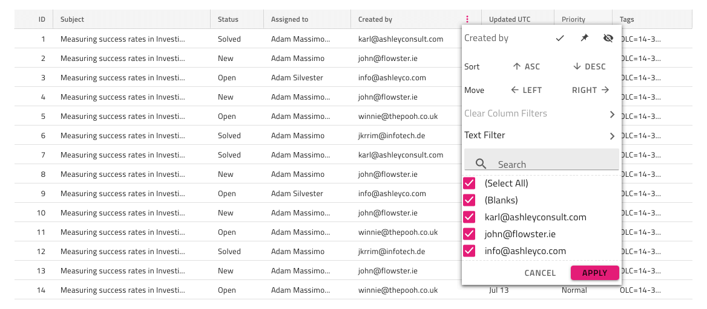
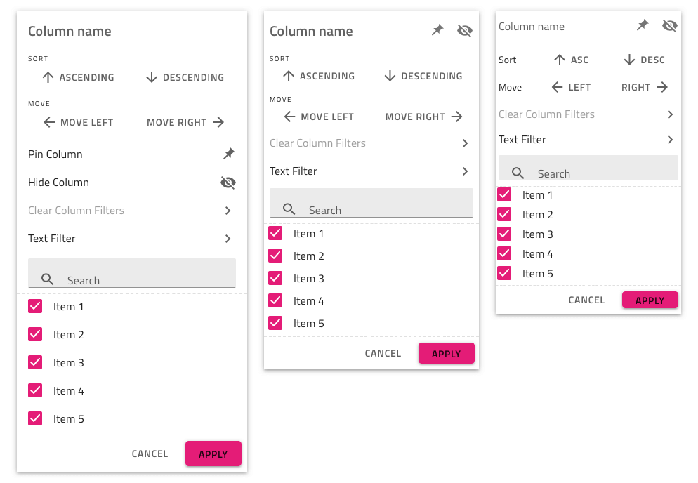

# Grid Excel Style Filter

Use the Grid Excel Style Filter to let the user specify a set of Grid features on the column: filtering by unique value or multiple conditions, sorting, column moving, hiding, and pinning. Only one column at a time may show the Excel Style Filter, and its Header Filter State must be set to active (see Header Cell below). The Grid Excel Style Filter is visually identical to the dialog used for the [Ignite UI for Angular Grid Excel Style Filtering Feature](https://www.infragistics.com/products/ignite-ui-angular/angular/components/grid/excel_style_filtering.html)

## Grid Excel Style Filter Demo

## Header Cell

In order to indicate that a column has an active Excel Style Filter (the overlay for it is visible) you first need to set the `Feature Left` or `Feature Right` override to `Filtering` and then configure the next override in the panel `Filter State` to `Filtering/Active`. If you want to indicate that a column has Excel Style Filtering enabled you can use either the `Filtering/Inactive` state indicating that no filtering conditions are applied on this column, or the `Filtering/Filtered` state indicating that filtering conditions have been applied and the overlay for the column has been closed.

## Excel Style Filter Feature

The Grid has three `Excel Style Filter` symbols under `Features`, one for each Display Density, that represent the overlay shown for the affected column. Adding this symbol has only a visual effect on your design to make it more realistic, if you want to switch the Excel Style Filter feature, configure the Header Cells accordingly.

> [!Note]
> Make sure to pick a Display Density variant for the Excel Style Filter overlay that matches the Grid Display Density since it is the one that is inherited by all features of the Grid.

### Overlay Customization

The Excel Style Filter overlay lets you configure the Column name to reflect the column that triggered it as well as the list of unique values at the bottom with their on/off state and item Text. The other features are not configurable.

### Sorting, Moving, Hiding and Pinning

The Excel Style Filter interface provides additional functionality besides filtering such as Sorting, Column Moving, Column Hiding, and Column Pinning. There are no overrides for these features, therefore they are not configurable. If any of them are enabled on the column via the Header Cell (see how to enable them in their respective topic) the user interface elements for the feature will be shown in the Excel Style Filter interface according to the Grid Display Density that is being applied.

## Additional Resources

Related topics:

- [Grid](grid.md)
- [Grid Row Filter](grid-row-filter.md)
- [Grid Advanced Filter](grid-advanced-filter.md)
- [Grid Display Density](grid-display-density.md)
- [Grid Sorting](grid-sorting.md)
- [Grid Column Moving](grid-column-moving.md)
- [Grid Column Hiding](grid-column-hiding.md)
- [Grid Column Pinning](grid-column-pinning.md)
  

Our community is active and always welcoming to new ideas.
