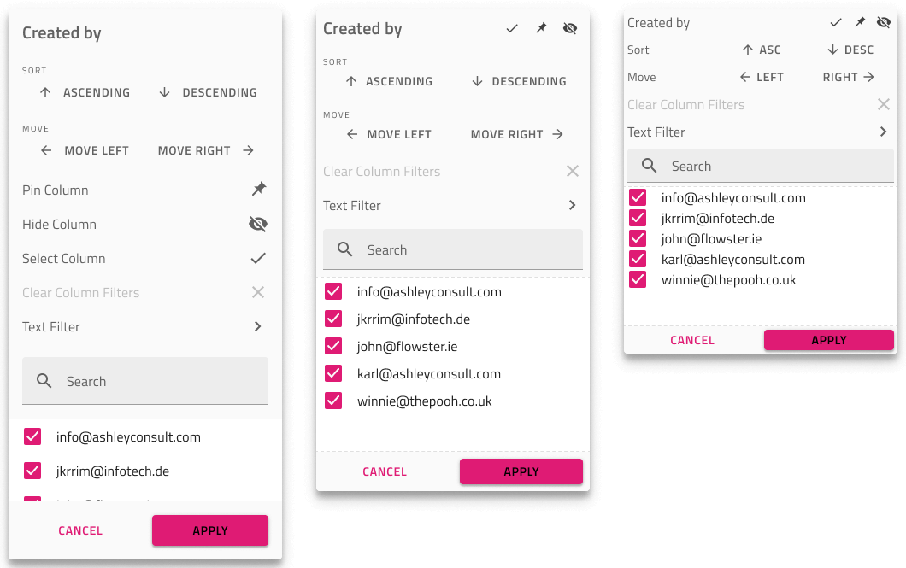

# Grid Excel Style Filter

Use the Grid Excel Style Filter to let the user specify a set of Grid features on the column: filtering by unique value or multiple conditions, sorting, column selection, moving, hiding, and pinning. Only one column at a time may show the Excel Style Filter, and its Header Cell must have `Feature Left` or `Feature Right` set to `Filtering Active` (see Header Cell below). The Grid Excel Style Filter is visually identical to the dialog used for the [Ignite UI for Angular Grid Excel Style Filtering Feature](https://www.infragistics.com/products/ignite-ui-angular/angular/components/grid/excel_style_filtering.html)

## Grid Excel Style Filter Demo

## Header Cell

In Figma to use the Excel Style Filtering you need to open the Grid Header Cell layer, select either the `Feature Left` or `Feature Right` component and change the `Type` property to `Filtering Inactive`, `Filtering Active` or `Filtering Filtered`.

## Excel Style Filter Feature

In Figma, there is an `Excel Style Filter` component under `Grid Features`, and via the `Size` property you can easily switch between the three sizes available. Adding the Excel Style Filter has only a visual effect on your design to make it look more realistic, if you want to turn the Excel Style Filter feature on, configure the Header Cells accordingly.

> [!Note]
> Make sure to pick a Size variant for the Excel Style Filter that matches the Grid Size since it is the one that is inherited by all features of the Grid.

### Overlay Customization

The Excel Style Filter overlay lets you configure the Column name to reflect the column that triggered it as well as the list of unique values at the bottom with their on/off state and item Text. The other features are not configurable.

### Sorting, Selection, Moving, Hiding and Pinning

The Excel Style Filter interface provides additional functionality besides filtering such as Sorting, Column Selection, Column Moving, Column Hiding, and Column Pinning that are not configurable. If any of them is enabled on the column via the Header Cell (see how to enable them in their respective topic) the user interface elements for the feature will be shown in the Excel Style Filter interface according to the Grid Size that is being applied.

## Additional Resources

Related topics:

- [Grid](grid.md)
- [Grid Row Filter](grid-row-filter.md)
- [Grid Advanced Filter](grid-advanced-filter.md)
- [Grid Sizes](grid-sizes.md)
- [Grid Sorting](grid-sorting.md)
- [Grid Column Moving](grid-column-moving.md)
- [Grid Column Hiding](grid-column-hiding.md)
- [Grid Column Pinning](grid-column-pinning.md)
  

Our community is active and always welcoming to new ideas.
