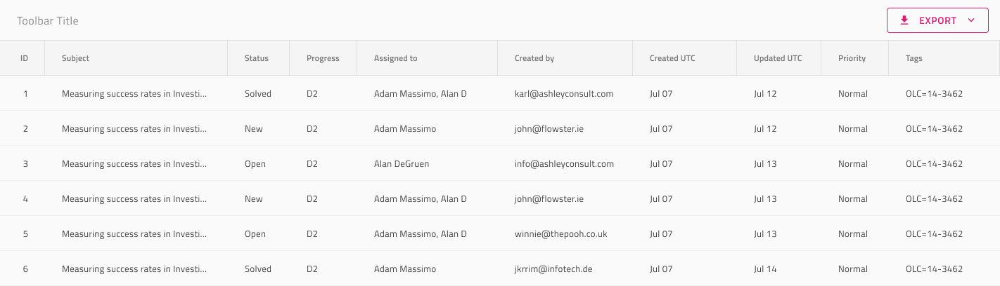

# Grid Export

Use the Grid Export to allow users to export Excel and CSV files from the Grid. The Grid Export is visually identical to the second sample in the [Ignite UI for Angular Grid Toolbar Feature](https://www.infragistics.com/products/ignite-ui-angular/angular/components/grid/toolbar.html) and behaves similarly to [Ignite UI for Angular Grid Export to Excel Feature](https://www.infragistics.com/products/ignite-ui-angular/angular/components/grid/export_excel.html).

## Grid Export Demo

## Toolbar

The Grid Export is achieved by adding a Toolbar with an Export action that enables the feature for the whole grid.

## Code generation

Make sure to place the Toolbar within the group defining the Grid as a sibling to the Header and Body groups.

## Additional Resources

Related topics:

- [Grid](grid.md)
- [Grid Toolbar](grid-toolbar.md)
  

Our community is active and always welcoming to new ideas.
