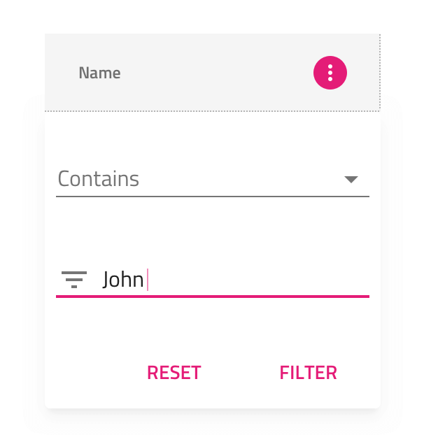
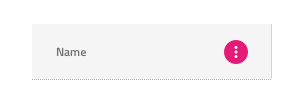
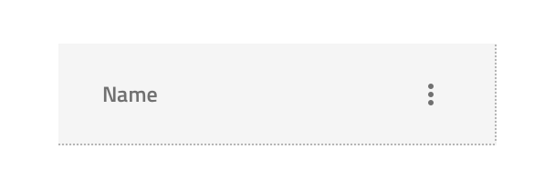
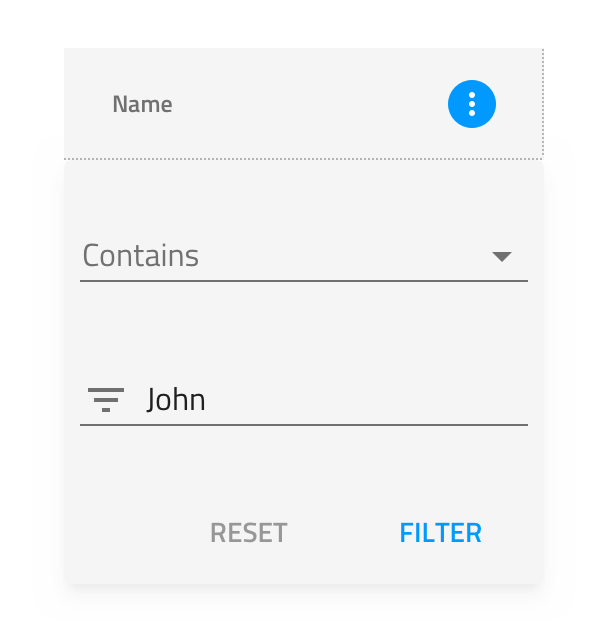

## Grid Filter

Use the Grid Filter Component Symbol to let the user specify filtering criteria on a Grid column. Only one column at a time may show the Grid Filter and its Header Filter State must be set to active (see Filter State below).
The Grid Filter is visually identical to the dialog used for the [Ignite UI for Angular Grid Filtering Feature](https://www.infragistics.com/products/ignite-ui-angular/angular/components/grid_filtering.html)

### Grid Filter Demo

### Filter State

The Grid Filter State found in the Header Cell provides choice between the three states of interaction with filtering: **inactive** state indicating the possibility to apply filtering on the column, active state when the a dialog is visible to allow defining the filtering criteria, and filtered state to indicate that a filter has been applied once the dialog is not visible anymore.

### Styling

The Grid Filter State found in the Header Cell comes with styling flexibility through various overrides for the icon and active background colors.
The Grid Filter dialog comes with styling flexibility through the various overrides for the dialog background color, as well as the available styling for the [Inputs](input.md) and [Flat Buttons](button.md) used.

## Additional Resources

Related topics:

* [Button](button.md)
* [Grid](grid.md)
* [Input](input.md)
  

Our community is active and always welcoming to new ideas.

* [Design System **Forums**](https://www.infragistics.com/community/forums/f/ignite-ui-for-angular)
* [Design System **GitHub**](https://github.com/IgniteUI/igniteui-angular)
