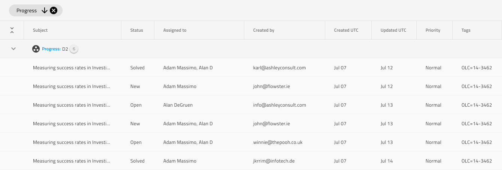

# Grid Group By

Use Grid Group By to organize data records in a hierarchical collection of groups defined by the matching values within a given column. The order of Group By conditions is represented in a special area above the Grid Header and special rows are inserted between Grid records to mark the beginning of a new group. The Grid Group By is visually identical to the [Ignite UI for Angular Grid Group By Feature](https://www.infragistics.com/products/ignite-ui-angular/angular/components/grid/groupby.html)

## Grid Group By Demo

## Group Area

The Grid has a `Group Area` that specifies the columns that are used to establish the hierarchical grouping of records and the order in which these groups will be nested. In Figma the `Group Area` component can be found under `Grid Features` and inserted from the assets panel inside the Grid Component, once the Grid Component is detached. You can directly modify the [Chips Area](chips.md) inside the `Group Area`, without detaching.

## GroupBy Row

The Grid has a `GroupBy Row` component under `Grid Features` that represents a special row in the Grid that is like a heading preceding the grouped records with some summary information about their amount within the group. Adding this component has only a visual effect on your design to make it more realistic. In Figma, you need to detach the Grid first and then insert the `GroupBy Row` component.

## Additional Resources

Related topics:

- [Grid](grid.md)
- [Chips](chips.md)
  

Our community is active and always welcoming to new ideas.
