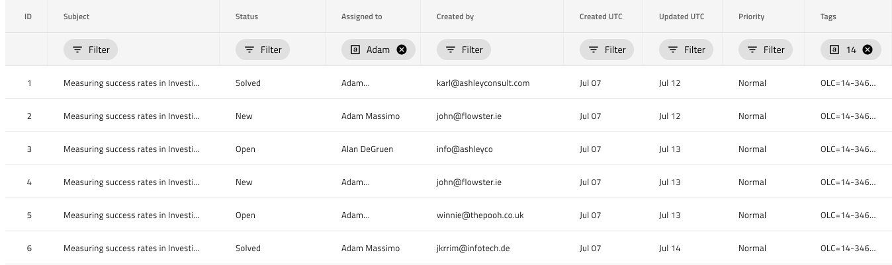

# Grid Row Filter

Use the Grid Row Filter to specify filtering criteria on a Grid column via a special type of Header Cell that contains Chips with the filtering conditions. The Grid Row Filter is visually identical to [Ignite UI for Angular Grid Filtering Feature](https://www.infragistics.com/products/ignite-ui-angular/angular/components/grid/filtering.html)

## Grid Row Filter Demo

## Row Filter Header

In order to indicate that a Grid is filterable via a Row Filter, add a second Header row with Row Filter Header Cells for each of the columns of the Grid within the `Header` group.

## Filter State

The Row Filter Header Cells come with a `Filter State` override that lets you configure whether a filtering condition has been applied on a given column when set to Filtered or no filtering condition is applied, which also happens to be the default state **Empty**.

## Additional Resources

Related topics:

- [Grid](grid.md)
- [Grid Excel Style Filter](grid-excel-style-filter.md)
- [Grid Advanced Filter](grid-advanced-filter.md)
  

Our community is active and always welcoming to new ideas.
