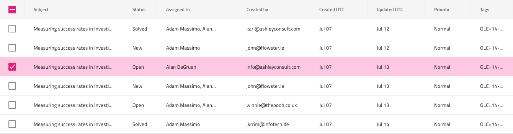

## Grid Row Selection

Use the Grid Row Selection to let one select complete rows at once via a special selection column with checkboxes that appears as the leftmost column of the Grid. The Grid Row Selection is visually identical to the Row Selection mode of the [Ignite UI for Angular Grid Selection Feature](https://www.infragistics.com/products/ignite-ui-angular/angular/components/grid/selection.html#grid-row-selection)

### Grid Row Selection Demo

### Row Selection Column

The Grid Row Selection can be achieved through the creation of an additional column to the left of the first one and configuring the `Type` of its Header and Body cells to `Checkbox`. For selected rows the state of the checkbox has to be set to `On`.

### Row Selection Cells

The Grid provides a special type of Body Cells for selected rows available via the `Grid Feature` override. Once you set it to `RowSelected/Cell` a destinguishabe style will be applied indicating the cell belonging to a selected row.

## Additional Resources

Related topics:

- [Grid](grid.md)
  

Our community is active and always welcoming to new ideas.
