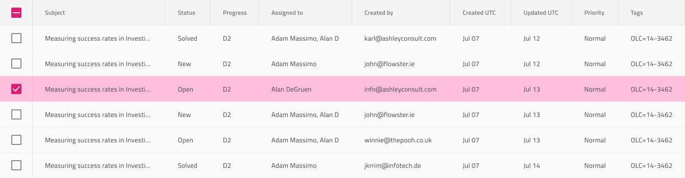
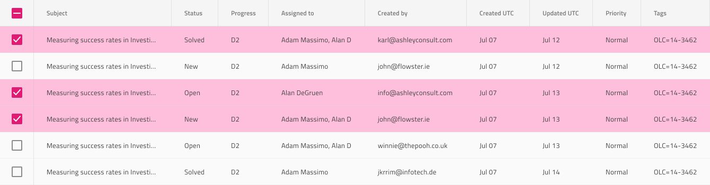

# Grid Row Selection

Use the Grid Row Selection to select complete rows at once via a special selection column with checkboxes that appears as the leftmost column of the Grid. The Grid Row Selection is visually identical to the Row Selection mode of the [Ignite UI for Angular Grid Selection Feature](https://www.infragistics.com/products/ignite-ui-angular/angular/components/grid/selection.html#grid-row-selection)

## Grid Row Selection Demo

## Row Selection Column

The Grid Row Selection can be achieved through the creation of an additional column to the left of the first one and configuring the `Type` of its Header and Body cells to `Row Selection`. For selected rows, the state of the row checkbox has to be set to `On` and the state of the header checkbox has to be set to `Indeterminate`. If all rows are selected, the state of row checkbox and the header have to be set to `On`.

  

    

      

        

  

    

## Row Selection Cells

The Grid provides a special type of Body Cells for selected rows and once you set it, a distinguishable style will be applied to indicate that the cell belongs to a selected row. In Figma, you can achieve this by selecting the nested `Cell State` component inside the grid cells and switch on the `Row Selected` boolean property on the properties panel.

## Additional Resources

Related topics:

- [Grid](grid.md)
  

Our community is active and always welcoming to new ideas.
