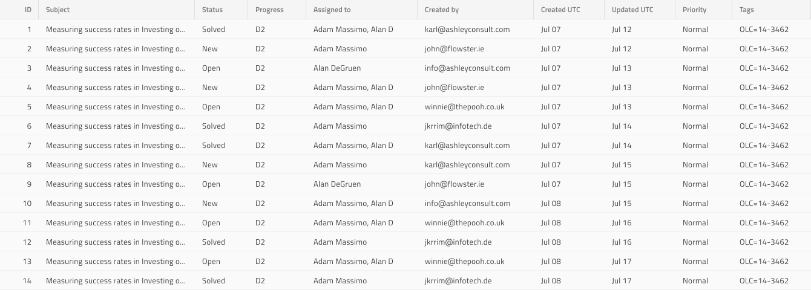

# Grid Size

The Grid comes in three pre-built variants according to the three sizes supported: large, medium, and small, where the first one is the airiest layout and the last one is the densest one. The Grid Size is visually identical to the [Ignite UI for Angular Grid Size Feature](https://www.infragistics.com/products/ignite-ui-angular/angular/components/grid/display_density.html).

The more data a grid has to display, the denser its layout needs to be. This also leaves less and less whitespace in the layout of all its elements including the header and body cells, overlays and dialogs, as well as elements that are attached to the grid above or below the main content like the Toolbar and the Summaries.

## Grid Size - Large

## Grid Size - Medium

## Grid Size - Small

> [!Note]
> When working with Size make sure that all your Grid elements and features use the same Size type.

## Additional Resources

Related topics:

- [Grid](grid.md)
  

Our community is active and always welcoming to new ideas.
