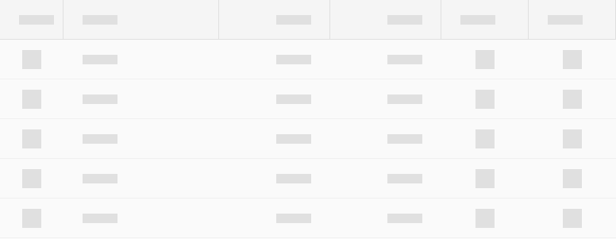
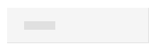
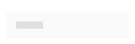
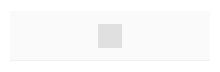
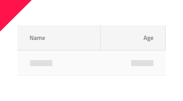

# Skeleton Grid

Use the Skeleton Grid to layout the same type of information that you would in the standard one, but to also indicate an application state when no data is present at the moment e.g. when data is loaded from a remote data source and there is either lack of connectivity, or it takes some time. The Skeleton Grid is just a visual representation of a [Grid](grid.md) with a known layout, but without any data to show.

## Grid Demo

## Cell Types

The Skeleton Grid supports the same three types of cells as the standard [Grid](grid.md): **Header**, **Body**, and **Summary**.

## Cell Size

The Skeleton Header, Body, and Summary Cells support the same three size variants as the standard [Grid](grid.md): **Large**, **Medium** and **Small**.

## Cell Type

The Skeleton Grid Header Cell provides presets for the **Number** and **Text,Date,Bool** types of data as the standard [Grid](grid.md).

The Skeleton Grid Body Cell provides presets for the same types of data like the Skeleton Grid Header Cell with an additional **Icon** type to visualize simple graphics.

## Usage

When creating grids, avoid combining standard and skeleton cells. Data is either present for all cells, or for none of them, thus the two types should not be used within the same grid layout.

| Do                                                                                                | Don't                                                                                                 |
| ------------------------------------------------------------------------------------------------- | ----------------------------------------------------------------------------------------------------- |
|  |  |

## Additional Resources

Related topics:

- [Grid](grid.md)
  

Our community is active and always welcoming to new ideas.
