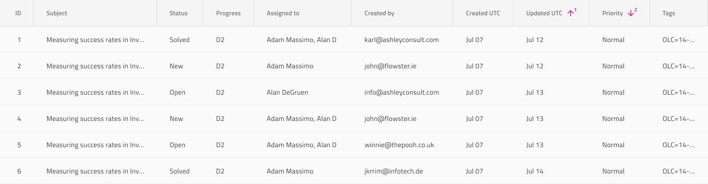

# Grid Sorting

Use Grid Sorting to indicate the ordering of records in ascending and descending order according to the values within a given column. The Grid Sorting is visually identical to the [Ignite UI for Angular Grid Sorting Feature](https://www.infragistics.com/products/ignite-ui-angular/angular/components/grid/sorting.html)

## Grid Sorting Demo

## Header Cell Feature

In order to indicate a column as sortable in Sketch use either the `Feature Left` or `Feature Right` overrides and set it to `Sorting`. Then you can set the `Sorting State` to Ascending, Descending, or **Unsorted** to indicate the sort order. In Figma, to indicate a column as sortable, use either the `Feature Left` or `Feature Right` component instance, located inside the Grid Header Cell layer, and set the `Type` property to Ascending, Descending, or **Unsorted** to indicate the sort order. In Adobe XD you have to take a slightly different path by unhiding either the `Feature Left` or `Feature Right` group and then leaving just the `Sorting` layer inside it, which should also be unhidden if necessary. Then via the available `Component States`, you will be able to switch the state to `Ascending` or `Descending`. Of course, you would probably want to manipulate the column values to reflect the selected ordering.

## Additional Resources

Related topics:

- [Grid](grid.md)
  

Our community is active and always welcoming to new ideas.
