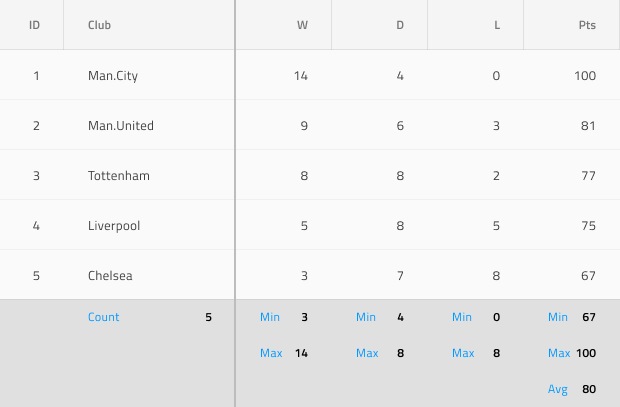
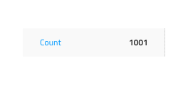
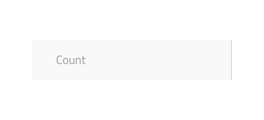
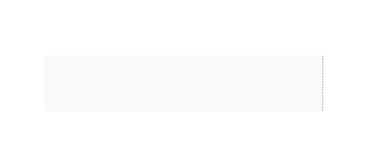
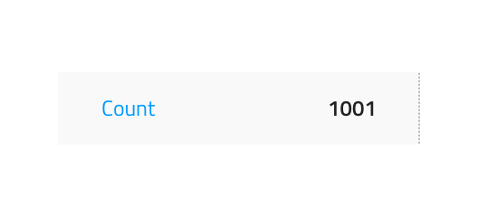
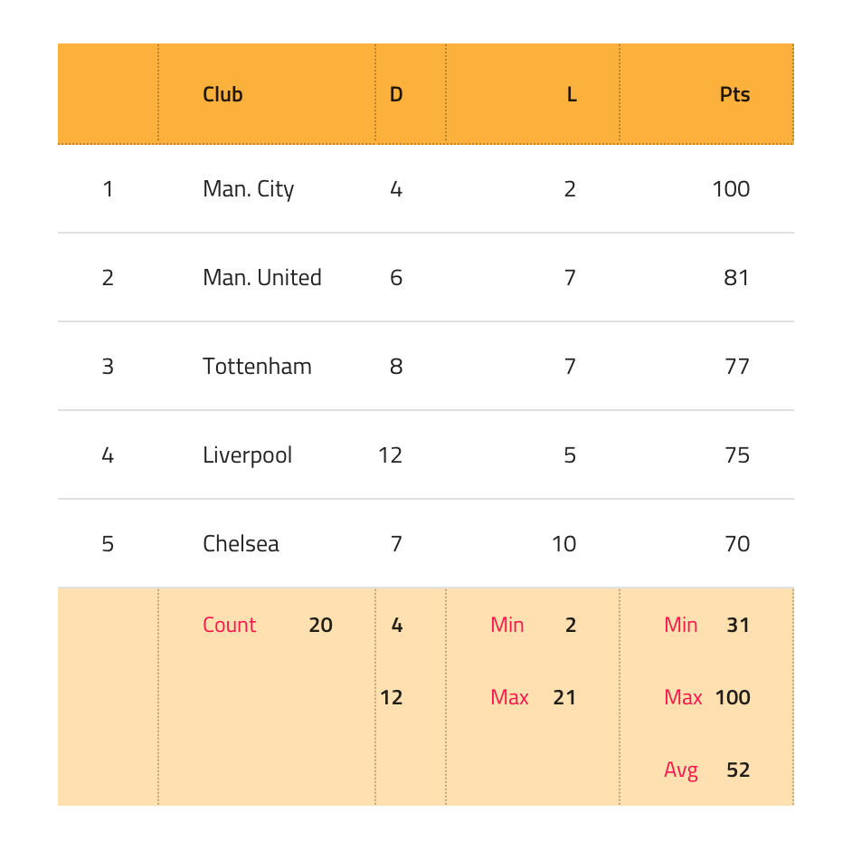

## Grid Summaries

Use the Grid Summaries Component to show aggregated values calculated over all the data in the respective Grid column. This is achievable through the insertion of special cells called Summary at the bottom of the Grid to shape up a tabular area matching the Grid structure but containing a Label and Number containing information about the aggregate value. The Grid Paging is visually identical to the [Ignite UI for Angular Grid Paging Feature](https://www.infragistics.com/products/ignite-ui-angular/angular/components/grid_paging.html)

### Grid Summaries Demo

### State

The Grid Summary Cell supports the following interactive states: **active** which shows a summary Label and Number, inactive which shows a grayed out Label and hides the Number, and unavailable
which is used to fill the gaps when one column has less Summaries than another.

### Type

The Grid Summary Cell provides presets for the two generic types of data aggregates that it needs to accommodate: **Number** for numeric values and Text for strings.

### Styling

The Grid Summary Cell comes with basic styling flexibility through the various overrides controlling its label and number text colors, as well as the cell background color.

## Code generation

When one or more Summary objects is added to the Sketch diagram, those summaries will be generated for each associated column. The developer is responsible for setting up a class for custom summary calculations, which is explained in more detail in this [Ignite UI for Angular help topic](https://www.infragistics.com/products/ignite-ui-angular/angular/components/grid_summaries.html). Code generation applies the Sketch Summary styles to the SCSS. If summary classes have not yet been set up, when the project runs in the browser, the default column summaries are rendered based on the column type as shown in the below image.

> [!Note]
> There is an issue with the Ignite UI Summary Theme rendering, the background color function does not render the color, instead the Header color gets rendered. When this is corrected the correct color from the Sketch drawing will be rendered properly.

## Additional Resources

Related topic:

- [Grid](grid.md)
  

Our community is active and always welcoming to new ideas.

