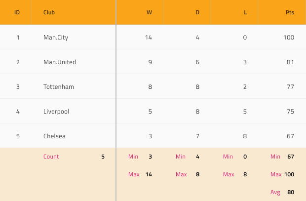

# Grid Summaries

Use the Grid Summaries Component to show aggregated values calculated over all the data in the respective Grid column. This is achievable through the insertion of special cells called Summary at the bottom of the Grid to shape up a tabular area matching the Grid structure but containing a Label and Number containing information about the aggregate value. The Grid Summaries is visually identical to the [Ignite UI for Angular Grid Summary Feature](https://www.infragistics.com/products/ignite-ui-angular/angular/components/grid/summaries.html)

## Grid Summaries Demo

## State

The Grid Summary Cell supports the following interactive states: **available** which shows a summary Label and Number and unavailable which is used to fill the gaps when one column has fewer Summaries than another.

## Type

The Grid Summary Cell provides presets for the two generic types of data aggregates that it needs to accommodate: **Number** for numeric values and Text for strings.

## Styling

The Grid Summary Cell comes with basic styling flexibility through the various options for its label and number text colors, as well as the cell background color.

## Additional Resources

Related topic:

- [Grid](grid.md)
  

Our community is active and always welcoming to new ideas.

