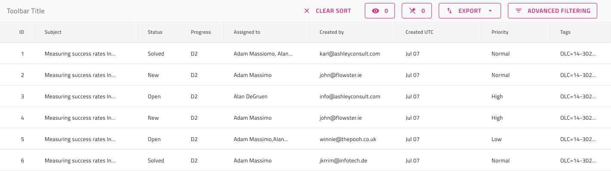
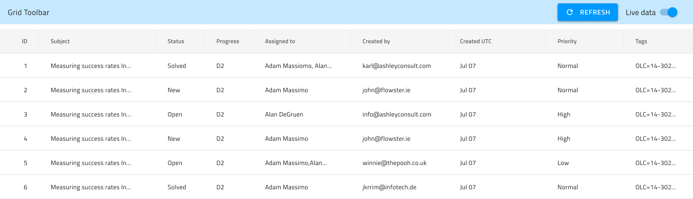

# Grid Toolbar

Use the Grid Toolbar to define actions that affect the appearance and behavior of the whole grid. By default, the Toolbar will contain actions for showing/hiding and pinning/unpinning of columns, as well as Exporting the Grid content in various formats. The Grid Toolbar is visually identical to the [Ignite UI for Angular Grid Toolbar Feature](https://www.infragistics.com/products/ignite-ui-angular/angular/components/grid/toolbar.html)

## Grid Toolbar Demo

## Styling

The Grid Toolbar comes with styling flexibility through the various overrides for its Actions, as well as its title style and background color.

## Additional Resources

Related topics:

- [Grid](grid.md)
- [Grid Column Hiding](grid-column-hiding.md)
- [GridGrid Column Pinning](grid-column-pinning.md)
- [Grid Export](grid-export.md)
  

Our community is active and always welcoming to new ideas.
