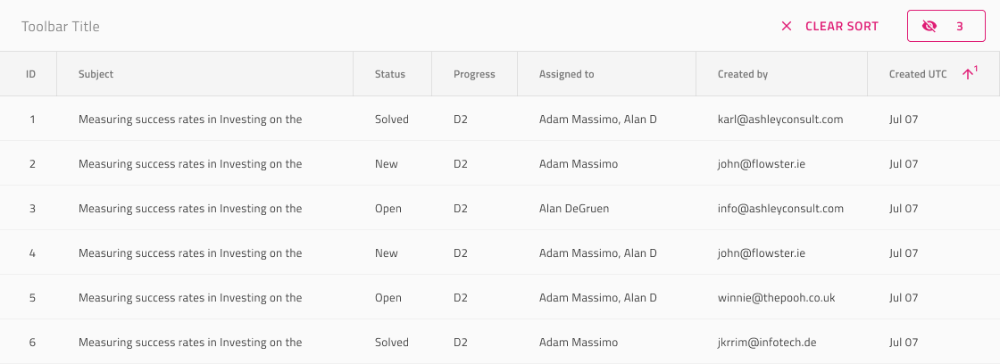

# Grid Toolbar

Use the Grid Toolbar to define actions that affect the appearance and behavior of the whole grid. By default, the Toolbar will contain actions for showing/hiding and pinning/unpinning of columns, as well as Exporting the Grid content in various formats. The Grid Toolbar is visually identical to the [Ignite UI for Angular Grid Toolbar Feature](https://www.infragistics.com/products/ignite-ui-angular/angular/components/grid/toolbar.html)

## Grid Toolbar Demo

## Layout

The Grid Toolbar uses auto layout in Figma. It has interchangeable default and custom actions, which gives absolute freedom to change its content and layout. If you don't need an action, you can just hide it from the layers panel and the layout will adjust appropriately.

  

    

## Styling

The Grid Toolbar comes with styling flexibility through the various options for its Actions, as well as its title style and background color.

## Additional Resources

Related topics:

- [Grid](grid.md)
- [Grid Column Hiding](grid-column-hiding.md)
- [Grid Column Pinning](grid-column-pinning.md)
- [Grid Export](grid-export.md)
  

Our community is active and always welcoming to new ideas.
