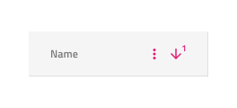
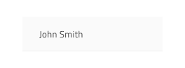

# Grid

Use the Grid Component to let the user browse and interact with a vast amount of complex data that is visually represented in tabular fashion and provide means for filtering, sorting, paging, and much more. The Grid is visually identical to the [Ignite UI for Angular Grid Component](https://www.infragistics.com/products/ignite-ui-angular/angular/components/grid.html)

## Grid Demo

## Detach from Symbol

The Grid is essentially a repeater of columns and rows showing data in a tabular fashion. Therefore, the easiest way to use it is by dragging one of the predefined grids to your artboard - there are three presets available for the three [display densities](grid-display-density.md) supported. Once in your artboard, by right-clicking on top of it, and selecting the `Detach from Symbol` option near the bottom of the contextual menu you should see the following in your layers panel under the newly appeared group:

| Layer                                    | Use                                                                                                                                                  |
| ---------------------------------------- | ---------------------------------------------------------------------------------------------------------------------------------------------------- |
| 🚫 metadata | A special locked layer starting with a prohibited icon. This layer is required by the code generation and you should avoid deleting or modifying it. |
| Header                                   | Contains all the cells in the header                                                                                                                 |
| Body                                     | Contains all the cells in the body                                                                                                                   |

After detaching, you may alter the number of headers you need, in order to show all the dimensions of your data and insert as many visible records as you want to show in your design simply by duplicating one of the rows of data that you already have.

## Cell Types

The Grid provides three types of cells serving different data visualization purposes. The Header Cell is only one per column and appears at the top of the grid to display the textual description of the data in that particular column. The Body Cell is used to build the content table displaying data records and its type may vary. The Summary Cell is used to create a section at the bottom of the Grid where [Summaries](grid-summaries.md) columns are displayed for each dimension such as count, minimum, and maximum value.

There is also one special sub-type of Header Cell, the Row Filter Header Cell that is used to create an additional Header row at the bottom of the Header in order to enable the [Row Filtering](grid-row-filter.md) functionality.

## Cell Display Density

Header, Body, and Summary Cells support the three display density variants of the Grid and come with distinct symbols for each one as can be seen for the Header Cells below:

## Items and Features (Header Cell)

The Grid Header Cell supports various layout combinations through the `Items` override and different feature configurations via the `Feature Left` and `Feature Right` overrides. Moreover there are a number of additional overrides that are not visible but enable different column features on the Grid, such as [Editing](grid-editing.md), [Moving](grid-column-moving.md), [Resizing](grid-column-resizing.md), and [Hiding](grid-column-hiding.md).

## State and Grid Feature (Body Cell)

The Grid Body Cell supports the following interactive states: **inactive** for the normal state and active for the focused/selected cell.
_Default value is styled with_ **bold** _text._

The Grid Body Cell has styling support for some of the Grid features defined through the headers via the `Grid Feature` override that gives access to cells styled for regular cells, editable cells, and cells that belong to a selected row.

## Cell Type

The Grid Header Cell provides presets for the three generic types of data that the Grid needs to accommodate: **Number** for numeric values, Text,Date,Bool for strings, Row Selection that is used for the first column in order to allow selection of multiple rows, and Group By is used to expand and collapse the grouped data rows.

The Grid Body Cell provides presets for the same generic types of data like the Header Cell with an additional icon type to visualize simple graphics.

## Grid Horizontal Scrolling

One way to achieve certain Grid dimensions, either as an absolute width or in relation to a parent group/container, is by adding a mask within the main group for the Grid. Simply insert a rectangle without any style and set its dimensions according to your needs, in the image below we have a Grid that is always exactly 800px wide.

You may fix the width and height of the rectangle, change its name to `Mask` and position it at the bottom of the layers panel. Then right-click on top of it and select the `Mask` option near the bottom of the contextual menu.

Now your Grid group will take the dimensions of the Mask and you may use it in your layout in the same way as you would use a Grid without horizontal scrolling. When code for this component is generated it will automatically add a horizontal scrollbar respecting the mask dimensions as a dimension for your Grid.

## Styling

The Grid comes with styling flexibility achievable through styling the individual cell text, icons, and background colors in the various states available, as well as the hiding of horizontal and vertical borders.

## Usage

The most important thing about the Grid is the alignment of the data inside its Header and Body Cells. Text should always be aligned left, leaving variable empty space to the right, and numbers should always be aligned right, leaving variable empty space to the left.

| Do                                                                                                | Don't                                                                                                 |
| ------------------------------------------------------------------------------------------------- | ----------------------------------------------------------------------------------------------------- |
|  |  |

## Additional Resources

Related topics:

- [Grid Toolbar](grid-toolbar.md)
- [Grid Export](grid-export.md)
- [Grid Grouping](grid-grouping.md)
- [Grid Column Pinning](grid-column-pinning.md)
- [Grid Column Hiding](grid-column-hiding.md)
- [Grid Column Moving](grid-column-moving.md)
- [Grid Column Resizing](grid-column-resizing.md)
- [Grid Sorting](grid-sorting.md)
- [Grid Row Filter](grid-row-filter.md)
- [Grid Excel Style Filter](grid-excel-style-filter.md)
- [Grid Row Selection](grid-row-selection.md)
- [Grid Editing](grid-editing.md)
- [Grid Display Density](grid-display-density.md)
- [Grid Paging](grid-paging.md)
- [Grid Summaries](grid-summaries.md)
- [Hierarchical Grid](hierarchical-grid.md)
- [Tree Grid](tree-grid.md)
- [Grid Patterns](../patterns/grid.md)
  

Our community is active and always welcoming to new ideas.
