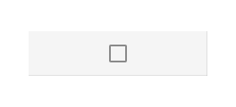

## Grid

Use the Grid Component Symbol to let the user browse and interact with vast amount of complex data that is visually represented in tabular fashion and provides means for filtering, sorting, paging etc.
The Grid is visually identical to the [Ignite UI for Angular Grid Component](https://www.infragistics.com/products/ignite-ui-angular/angular/components/grid.html)

### Grid Demo

### Detach from Symbol

The Grid is essentially a repeater of columns and rows showing data in a tabular fahion. Therefore, the easiest way to use it is by dragging a `Generic Grid` to your artboard, right clicking on top of it and selecting the `Detach from Symbol` option near the bottom of the contextual menu. In your layers panel under the newly appeared _Grid/Generic Grid_ group you should see the following:

> [!INFO]
> | Layer | Use |
> | ----------------------------- | ------------------------------- |
> | 🚫 igx-grid | A special locked layer starting with a prohibited icon. This layer is required by the code generation and you should avoid deleting or modifying it. |
> | Header | Contains all the cells in the header |
> | Body | Contains all the cells in the body |

After detaching you may add the number of headers you need to show all the dimensions of your data and as many records as you want to show in your design simply by duplicating the first row of data that you already have created.

### Cell Types

The Grid provides three types of cells serving different data visualization purposes. The Header Cell is only one per column and appears at the top of the grid to display the textual description of the data in that particular column. The Body Cell is used to build the table displaying data records and may vary. The Summary Cell is used to create a section at the bottom of the Grid where column [Summaries](grid-summaries.md) are displayed for each dimension such as count, minimum and maximum value.

### Items (Header Cell)

The Grid Header Cell supports the following layout combinations through the Items override: **No Icon** showing only a header text, Icon showing header text and filtering icon, and Icons showing header text, filtering icon and sorting icon.

### State (Body Cell)

The Grid Body Cell supports the following interactive states: **Rest** for the normal state, CellSelected for the selected cell in cell selection mode, and RowSelected for the remaining cells on the row, where the selected cell is belonging.

### Cell Type

The Grid Header Cell provides presets for the three generic types of data that it needs to accommodate: **Number** for numeric values, Text for strings, and Checbox that is usually used as a template for the first column in order to allow selection of multiple rows.

The Grid Body Cell provides presets for the same generic types of data like the Header Cell.

### Styling

The Grid comes with styling flexibility achievable through styling the individual cell text, icons and background colors in the various states available, as well as the hiding of horizontal and vertical borders.

## Usage

The most important thing about the Grid is the alignment of the data inside its Header and Body Cells. Text should always be aligned left, leaving variable empty space to the right and numbers should always be aligned right, leaving variable empty space to the left.

| Do                          | Don't                         |
| --------------------------- | ----------------------------- |
|  |  |

## Code generation

`🕹️DataSource`
`🕹️Event`

## Additional Resources

Related topics:

- [Grid Filter](grid-filter.md)
- [Grid Paging](grid-paging.md)
- [Grid Column Pinning](grid-column-pinning.md)
- [Grid Summaries](grid-summaries.md)
  

Our community is active and always welcoming to new ideas.

- [Indigo Design **GitHub**](https://github.com/IgniteUI/design-system-docfx)
