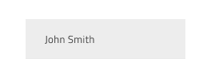
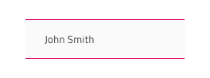
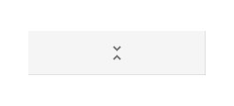

# Grid

Use the Grid Component to let the user browse and interact with a vast amount of complex data that is visually represented in tabular layout and provide means for filtering, sorting, paging, and much more. The Grid is visually identical to the [Ignite UI for Angular Grid Component](https://www.infragistics.com/products/ignite-ui-angular/angular/components/grid.html)

## Grid Demo

## Using the Grid in Figma

The Grid is essentially a repeater of columns and rows, showing data in a tabular layout. Therefore, the easiest way to use it is by dragging one of the predefined grids to your frame - there are three presets available for the three [sizes](grid-sizes.md) supported. Please note, that in Figma the Grid Component has a structure, based on columns, which means you can instantly delete or hide an entire column, but not an entire row. Once you insert the grid, you can then start editing the header and body cells or resize the overall width of the grid. However, in case you'd like to make any further adjustments to the grid structure, such as removing columns or rows, or changing the columns' width, you have to right-click on the grid and use the `Detach instance` option near the bottom of the contextual menu. On the layers panel you'll see the following structure under the component's name, without the need to detach it beforehand:

| Layer                                    | Use                                                                                                                                                  |
| ---------------------------------------- | ---------------------------------------------------------------------------------------------------------------------------------------------------- |
| 🚫 componentVersion &nbsp;&nbsp; | A special locked layer starting with a prohibited icon. This layer is required by the code generation and holds information about the component's version. You should avoid deleting or modifying it. |
| 🚫 metadata | A special locked layer starting with a prohibited icon. This layer is required by the code generation and you should avoid deleting or modifying it. |
| Column (number)                                 | Contains the Header and Body cells inside the specific column                                                                                                                 |
| Header                                   | Contains a specific header cell                                                                                                                 |
| Body (number)                                    | Contains a specific body cell                                                                                                                    |

After detaching, you may increase the number of columns inside the grid by duplicating any of the existing columns. In order to increase the number of body cells, you should first use the `Detach instance` option on the specific column and then duplicate any of the body cells that already exist inside the column. After you increase or decrease the number of columns or cells, you should manually adjust the size of the Grid component.

## Using the Grid in Sketch

To use the Grid component in Sketch you can insert one of the predefined grids to your artboard - there are three presets available for the three [display densities](grid-sizes.md) supported. Once in your artboard, by right-clicking on top of it, and selecting the `Detach from Symbol` option near the bottom of the contextual menu you should see the following in your layers panel under the newly appeared group:

| Layer                                    | Use                                                                                                                                                  |
| ---------------------------------------- | ---------------------------------------------------------------------------------------------------------------------------------------------------- |
| 🚫 metadata | A special locked layer starting with a prohibited icon. This layer is required by the code generation and you should avoid deleting or modifying it. |
| Column (number)                          | Contains the Header and Body cells inside the specific column
| Header                                   | Contains all the cells in the header                                                                                                                 |
| Body (number)                                    | Contains a specific body cell                                                                                                                    |

After detaching, you may alter the number of headers you need, in order to show all the dimensions of your data, and insert as many visible records as you want to show in your design simply by duplicating one of the rows of data that you already have.

## Using the Grid in Adobe XD

In Adobe XD, after you choose one of the three [preset display density grid components](grid-sizes.md) and drag it to your artboard, you will notice in the layers panel that we use `Repeat Grid` for both the Header and the Body to speed configuration up. Unlike in Sketch in Adobe XD destroying the symbol is not necessary. You should see the following in your layers panel:

| Layer                                    | Use                                                                                                                                                  |
| ---------------------------------------- | ---------------------------------------------------------------------------------------------------------------------------------------------------- |
| 🚫 metadata | A special locked layer starting with a prohibited icon. This layer is required by the code generation and you should avoid deleting or modifying it. |
| Header                                   | Contains all header cells grouped in a Header Repeat Grid                                                                                                         |
| Body                                     | Contains all body cells grouped in a Body Repeat Grid                                                                                                                   |

When you select the Header or Body Repeat Grid layer, you may alter the number of the repeated cells you need by dragging the green handles at the right or bottom edge to show all the dimensions of your data and insert as many visible records as you want to show in your design. To change a particular cell type or column width, you have to select the Repeat Grid layer and click `Ungroup Grid` in the right panel. This will allow you to work the cells separately to achieve the desired design.

## Cell Types

The Grid provides three types of cells, serving different data visualization purposes. The Header Cell is only one per column and appears at the top of the grid to display the textual description of the data in that particular column. The Body Cell is used to build the content table, displaying data records, and its type may vary. The Summary Cell is used to create a section at the bottom of the Grid, where [Summaries](grid-summaries.md) columns are displayed for each dimension, such as count, minimum, and maximum value.

There is also one special sub-type of Header Cell, the Row Filter Header Cell that is used to create an additional Header row at the bottom of the Header in order to enable the [Row Filtering](grid-row-filter.md) functionality.

## Cell Size

Header, Body, and Summary Cells support three variants for the according sizes of the Grid component: Large, Medium, and Small. In Sketch, each of them come with distinct symbols, whereas in Figma, the cells' size and the content inside are properties that can be changed separately from the properties panel:

> [!NOTE]
> We advise you not to change the size of the grid cells, once you've selected a Grid Component with a certain size.

## Items and Features (Header Cell)

The Grid Header Cell supports various layout combinations through the `Items` override/instance and different feature configurations via the `Feature Left` and `Feature Right` overrides/instances. Moreover there are a number of additional overrides/instances that don't visually alter the cells, but enable different column features on the Grid, such as [Editing](grid-editing.md), [Moving](grid-column-moving.md), [Resizing](grid-column-resizing.md), [Hiding](grid-column-hiding.md), and [Pinning](grid-column-pinning.md).  Since we are deprecating some of the features, in Figma we only support `Feature Left` and `Feature Right`.

## State and Grid Feature (Body Cell)

The Grid Body Cell supports the following interactive states: **Inactive** as a default state, **Selected**, **Active** and **Focused**. Only one cell in the whole grid can be active or focused at any given moment.

The Grid Body Cell has styling support for some of the Grid features defined in the headers via their `Grid Feature`. There are style variants for regular cells, editable cells, and cells that belong to a selected row. In Figma switching between the different body cell states is achieved through the `Cell State`,`Row Selected` and `Row Editing` properties in the properties panel. In Sketch, to switch between `Grid Feature`-s you should use the available `Symbol Overrides`, while in Adobe XD there is a matching list of `Component States`.

## Cell Type

In Sketch and in Figma, the Grid Header Cell provides five presets for the types of data that the Grid needs to accommodate: **Number** for numeric values, the one combining **Text,Date,Bool** for the respective data types, **Row Selection** that is used for the first column when selection of multiple rows is desired, **Group By** - used to expand and collapse grouped data rows, and **Row Filter** that is used where the user can activate specific filtering options, related to the content inside the body cells. In Figma there are two options for **Row Filter** - Empty or Filled. In Adobe XD the types are three: a standard one for **Data**, **Row Selection**, and **Group By**, with the standard one supporting choice between **Numeric** values and **Text,Date,Bool** via `Component States`.

The Grid Body Cell provides presets for the same generic types of data like the Header Cell with an additional icon type to visualize simple graphics and spacer type, used to display an empty body cell.

## Grid Horizontal Scrolling

In order to achieve horizontal scrolling in Figma, you need to add the Grid inside a frame with a size smaller than the actual grid width and activate the clipping option from the properties panel. Then you need to go to the `Prototype` tab at the top of the properties panel and set the scrolling to horizontal. Another option for achieving the same result is by detaching the Grid Component. Afterwards you'd need to reduce the frame size and then activate the clipping option from the properties panel. In Sketch and Adobe XD, one way to achieve certain Grid dimensions, either as an absolute width or in relation to a parent group/container, is by adding a mask within the main group for the Grid. Simply insert a rectangle without any style and set its dimensions according to your needs, in the image below we have a Grid that is always exactly 800px wide.

You may fix the width and height of the rectangle, change its name to `Mask` and position it at the bottom of the layers panel. Then right-click on top of it and select the `Mask` option near the bottom of the contextual menu.

Now your Grid group will take the dimensions of the Mask and you may use it in your layout in the same way as you would use a Grid without horizontal scrolling. When code for this component is generated it will automatically add a horizontal scrollbar respecting the mask dimensions and using them for your Grid.

## Styling

The Grid comes with styling flexibility achievable through styling the individual cell text, icons, and background colors in the various states available, as well as the hiding of horizontal and vertical borders.

## Usage

The most important thing about the Grid is the alignment of the data inside its Header and Body Cells. Text should always be aligned left, leaving variable empty space to the right, and numbers should always be aligned right, leaving variable empty space to the left.

| Do                                                                                                | Don't                                                                                                 |
| ------------------------------------------------------------------------------------------------- | ----------------------------------------------------------------------------------------------------- |
|  |  |

## Additional Resources

Related topics:

- [Grid Toolbar](grid-toolbar.md)
- [Grid Export](grid-export.md)
- [Grid Grouping](grid-grouping.md)
- [Grid Column Pinning](grid-column-pinning.md)
- [Grid Column Hiding](grid-column-hiding.md)
- [Grid Column Moving](grid-column-moving.md)
- [Grid Column Resizing](grid-column-resizing.md)
- [Grid Sorting](grid-sorting.md)
- [Grid Row Filter](grid-row-filter.md)
- [Grid Excel Style Filter](grid-excel-style-filter.md)
- [Grid Row Selection](grid-row-selection.md)
- [Grid Editing](grid-editing.md)
- [Grid Sizes](grid-sizes.md)
- [Grid Paging](grid-paging.md)
- [Grid Summaries](grid-summaries.md)
- [Hierarchical Grid](hierarchical-grid.md)
- [Tree Grid](tree-grid.md)
- [Grid Patterns](../patterns/grid.md)
- [Grid Skeleton](grid-skeleton.md)
  

Our community is active and always welcoming to new ideas.
