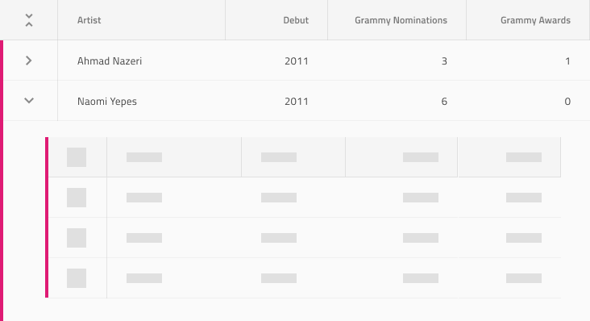
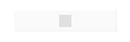

# Skeleton Hierarchical Grid

Use the Skeleton Hierarchical Grid to layout the same type of information that you would in the standard one, but to also indicate an application state when no data is present at the moment e.g. when data is loaded from a remote data source and there is either lack of connectivity, or it takes some time. The Skeleton Hierarchical Grid is just a visual representation of a [Hierarchical Grid](hierarchical-grid.md) with a known layout, but without any data to show.

## Skeleton Hierarchical Grid Demo

## Cell Types

The Skeleton Hierarchical Grid extends the three types of skeleton cells Header, Body, and Summary with two additional ones as the standard [Hierarchical Grid](hierarchical-grid.md): CollapseAll and Expand.

## Cell Size

The Skeleton CollapseAll and Expand cells support the same three size variants as the standard [Hierarchical Grid](hierarchical-grid.md): Large, Medium and Small.

## Grid Types

The Skeleton Hierarchical Grid supports the three display densities and offers variants for each of them with regard to the state of loading data: Initial which is shown when the Hierarchical Grid is loading data and there is no expanded row with a nested grid, and Expand which is shown when only the nested grid is loading data.

## Usage

When creating hierarchical grids, avoid combining standard and skeleton cells within the same hierarchy level. Data is either present for all cells and grids on a given level, or for none of them. Combining standard and skeleton cells is appropriate only in a very limited set of use cases such as the presets explained above.

| Do                                                                                                | Don't                                                                                                 |
| ------------------------------------------------------------------------------------------------- | ----------------------------------------------------------------------------------------------------- |
|  |  |

## Additional Resources

Related topics:

- [Hierarchical Grid](hierarchical-grid.md)
  

Our community is active and always welcoming to new ideas.
