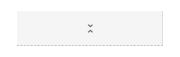
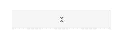

# Hierarchical Grid

Use the Hierarchical Grid Component to let the user browse and interact with a vast amount of complex data organized into separate tables hierarchically related one to another. Each grid in the hierarchy represents its own data in a tabular fashion and provides the same features as the [Grid](grid.md). The Hierarchical Grid is visually identical to the [Ignite UI for Angular Hierarchical Grid Component](https://www.infragistics.com/products/ignite-ui-angular/angular/components/hierarchicalgrid/hierarchical_grid.html)

## Hierarchical Grid Demo

## Detach from Symbol

Similarly to the Grid, the Hierarchical Grid is essentially a repeater of columns, rows, and nested grids forming a visual hierarchy. Therefore, the easiest way to use it is by dragging one of the predefined grids to your artboard - there are three presets available for the three [display densities](grid-display-density.md) supported. Once in your artboard, by right-clicking on top of it, and selecting the `Detach from Symbol` option near the bottom of the contextual menu you should see the following in your layers panel under the newly appeared group:

| Layer                                | Use                                                                                                                                                  |
| ------------------------------------ | ---------------------------------------------------------------------------------------------------------------------------------------------------- |
| 🚫 metadata | A special locked layer starting with a prohibited icon. This layer is required by the code generation and you should avoid deleting or modifying it. |
| 🌈 Drill Indication                  | A symbol that is used for indicating the active cell/cell in focus                                                                                                       |
| Header                               | Contains all the cells in the header                                                                                                                 |
| Body                                 | Contains all the cells in the body and a nested Grid with basic structure                                                                            |
| 🌈 Background                        | Defines the background color of the Hierarchical Grid                                                                                                |

After detaching, you may add the number of headers you need to show all the dimensions of your data and as many records as you want to show in your design simply by duplicating the first row of data that you already have created within each of the grids that you have. In case you need to show more of the hierarchy, you may also nest additional grids within the body of the parent one that they belong to.

## Cell Types

The Hierarchical Grid extends the three types of regular Grid cells Header, Body, and Summary with two additional ones that are used to organize the hierarchy. The CollapseAll cell is always used as the first Header Cell and comes with a predefined icon and action for collapsing/expanding all of the belonging records of the Grid in whose Header it appears. The Expand cell is always used as the first Body Cell in every row and comes with a predefined icon and action for collapsing/expanding the row.

To understand how regular Header, Body and Summary cells can be used for different types of data and configured to enable the various Hierarchical Grid features, please refer to the [general Grid topic](grid.md).

## Cell Display Density

The CollapseAll and Expand cells support three display density variants of the Hierarchical Grid: comfortable, cosy, and compact. Each of them come with distinct symbols as can be seen for the CollapseAll Header cells below:

Since the Hierarchical Grid can contain a number of nested grids in all kinds of hierarchical order, each of the child grids, excluding the root level parent grid, should utilize a special layer named `🚫 metadata`. The preset already comes with one nested grid in the body of the root-level grid and you may use it as the source for creating your layouts and hierarchies.

## Styling

The Hierarchical Grid comes with styling flexibility achievable through styling the individual cell text, icons, and background colors in the various states available, as well as the hiding of horizontal and vertical borders. It is also possible to style the Drill Indication and Grid background.

## Usage

Similarly to the Grid, the most important thing about the Hierarchical Grid is the alignment of the data inside its Header and Body Cells. Text should always be aligned left, leaving variable empty space to the right, and numbers should always be aligned right, leaving variable empty space to the left.

| Do                                                                                                | Don't                                                                                                 |
| ------------------------------------------------------------------------------------------------- | ----------------------------------------------------------------------------------------------------- |
|  |  |

## Additional Resources

Related topics:

- [Grid](grid.md)
- [Grid Toolbar](grid-toolbar.md)
- [Grid Export](grid-export.md)
- [Grid Grouping](grid-grouping.md)
- [Grid Column Pinning](grid-column-pinning.md)
- [Grid Column Hiding](grid-column-hiding.md)
- [Grid Column Moving](grid-column-moving.md)
- [Grid Column Resizing](grid-column-resizing.md)
- [Grid Sorting](grid-sorting.md)
- [Grid Row Filter](grid-row-filter.md)
- [Grid Excel Style Filter](grid-excel-style-filter.md)
- [Grid Row Selection](grid-row-selection.md)
- [Grid Editing](grid-editing.md)
- [Grid Display Density](grid-display-density.md)
- [Grid Paging](grid-paging.md)
- [Grid Summaries](grid-summaries.md)
- [Tree Grid](tree-grid.md)
  

Our community is active and always welcoming to new ideas.
