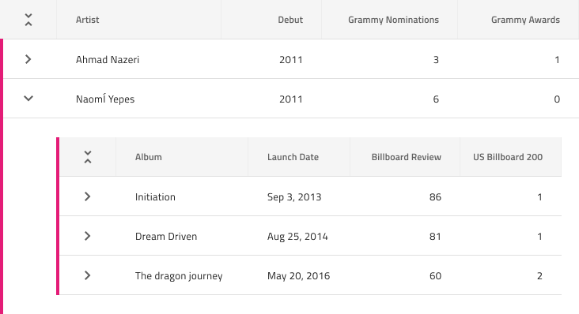
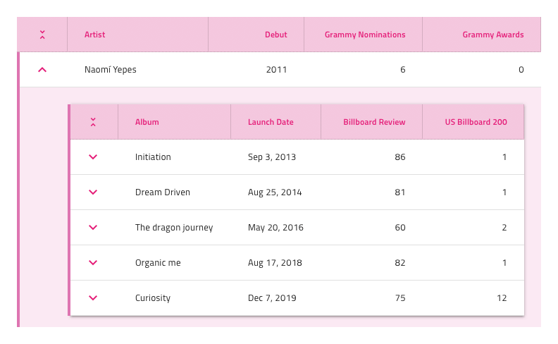

## Hierarchical Grid

Use the Hierarchical Grid Component to let the user browse and interact with vast amount of complex data organized into separate tables hierarchically related to one another. Each grid in the hierarchy represents its own data in tabular fashion and provides the same features as the [Grid](grid.md). The Hierarchical Grid is visually identical to the [Ignite UI for Angular Hierarchical Grid Component](https://www.infragistics.com/products/ignite-ui-angular/angular/components/hierarchicalgrid/hierarchical_grid.html)

### Hierarchical Grid Demo

### Detach from Symbol

Similarly to the Grid, the Hierarchical Grid is essentially a repeater of columns, rows and nested grids forming a visual hierarchy. Therefore, the easiest way to use it is by dragging a `Hierarchical Grid/Comfortable` to your artboard, right clicking on top of it, and selecting the `Detach from Symbol` option near the bottom of the contextual menu. In your layers panel under the newly appeared group, you should see the following:

| Layer                                | Use                                                                                                                                                  |
| ------------------------------------ | ---------------------------------------------------------------------------------------------------------------------------------------------------- |
| 🚫 igx-hierarchical-grid/comfortable | A special locked layer starting with a prohibited icon. This layer is required by the code generation and you should avoid deleting or modifying it. |
| 🌈 Drill Indication                  | A symbol that is used for indicating selection                                                                                                       |
| Header                               | Contains all the cells in the header                                                                                                                 |
| Body                                 | Contains all the cells in the body and a nested Grid with basic structure                                                                            |
| 🌈 Background                        | Defines the background color of the Hierarchical Grid                                                                                                |
| 🕹️PrimaryKey                         | Reference for the column with the primary keys of the records that is required by some Grid features and is used by the code generation engine       |
| 🕹️DataSource                         | Reference for the data source that the Grid will be bound to that is used by the code generation engine                                              |

After detaching, you may add the number of headers you need to show all the dimensions of your data and as many records as you want to show in your design simply by duplicating the first row of data that you already have created within each of the grids that you have. In case you need to show more of the hierarchy, you may also nest additional grids within the body of the parent one that they belong to.

### Cell Types

The Hierarchical Grid extends the three types of regular Grid cells Header, Body and Summary with two additional ones that are used to organize the hierarchy. The CollapseAll cell is always used as the first Header Cell and comes with a predefined icon and action for collapsing/expanding all of the belonging records of the Grid in whose Header it appears. The Expand cell is always used as the first Body Cell in every row and comes with a predefined icon and action for collapsing/expanding the row.

To understand how regular Header, Body and Summary cells can be used for different types of data and configured to enable the various Hierarchical Grid features, please refer to the [general Grid topic](grid.md).

### Nested Grids

Since the Hierarchical Grid can contain a number of nested grids in all kinds of hierarchical order, each of the child grids, excluding the root level parent grid, should utilize a special layer named`🚫 igx-hierarchical-grid/island` in the place of the root-level special layer `🚫 igx-hierarchical-grid...`. The preset already comes with one nested grid in the body of the root-level grid and you may use it as the source for creating your layouts and hierarchies.

### Styling

The Hierarchical Grid comes with styling flexibility achievable through styling the individual cell text, icons, and background colors in the various states available, as well as the hiding of horizontal and vertical borders. It is also possible to style the Drill Indication and Grid background.

## Usage

Similarly to the Grid, the most important thing about the Hierarchical Grid is the alignment of the data inside its Header and Body Cells. Text should always be aligned left, leaving variable empty space to the right, and numbers should always be aligned right, leaving variable empty space to the left.

| Do                                                                                                | Don't                                                                                                 |
| ------------------------------------------------------------------------------------------------- | ----------------------------------------------------------------------------------------------------- |
|  |  |

## Code generation

This section describes some important overrides and how they affect code generation.

> [!WARNING]
> The hierarchical grid **must** be a detached symbol to be able to be used.

> [!NOTE]
> The height of the hierarchical grid is set to `100%` as the default.

### Data Source Property

When supplied, the `🕹️DataSource` value is used to set up the data source for the grid and needs to be an array of objects, where each column name is a property on the object. If the data source is not supplied the grid will only render the column headers.

### Primary Key

When supplied, the `🕹️PrimaryKey` is used to set the `primaryKey` property on the grid.  The value of this property should be the name of a property in the data source that contains unique values.  This property is especially important if you wish to use the [row editing banner](https://www.infragistics.com/products/ignite-ui-angular/angular/components/grid/row_editing.html) in the grid.

### Header

When supplied, the Headers help determine the number of columns to be rendered. It will try and pair a Header with a Body (Cell) that is below it to form the column. If no matching Body can be found a column will be created based on the information that can be gathered from the Header. When a pair is found, information will be gathered from the Header first then the Body/Cell.

The Header has some sizing options available to it.  If you pin each header cell to the left and right in Sketch it will force the column to generate with a percentage width in HTML.  This will allow the column to grow or shrink depending on the size of the Grid.  Alternatively, you can fix the Header cell width which will generate a fixed column of that size.

#### Type

When supplied this is used to determine the type of the column (string, number, Boolean).

#### Text

The Header Text property may contain text, [binding text](../codegen/data-binding.md), or a combination of the two, examples:

- Settings
- {settingsLabel}
- Important {labelText}

#### Feature Left & Feature Right

These overrides control what features are enabled for the individual columns.  The following values are available:

- None (Default)
- Filtering ([Excel Style Filtering](https://www.infragistics.com/products/ignite-ui-angular/angular/components/hierarchicalgrid/excel_style_filtering.html))
- Pinning
- Sorting

#### Column Moving

This override determines whether the column is movable or not by the user.

#### Column Resizing

This override determines whether the column is resizable or not by the user.

#### Column Hiding

This override determines whether the column is hidden or not.

### Body/Cell

When supplied, the Bodies (cells) help determine the number of columns to be rendered. It will try and pair a Header with a Body (Cell). If no matching Header can be found a column will be created based on the information that can be gathered from the Body/Cell. When a pair is found information will be gathered from the Header first then the Body/Cell.

#### Data Property

When supplied, the `🕹️DataProperty` is used to setup the field of the column, which should correspond to a field in the `🕹️DataSource`.

#### Type

When supplied this is used to determine the type of the column (string, number, Boolean).

## Additional Resources

Related topics:

- [Grid](grid.md)
- [Grid Toolbar](grid-toolbar.md)
- [Grid Export](grid-export.md)
- [Grid Grouping](grid-grouping.md)
- [Grid Column Pinning](grid-column-pinning.md)
- [Grid Column Hiding](grid-column-hiding.md)
- [Grid Column Moving](grid-column-moving.md)
- [Grid Column Resizing](grid-column-resizing.md)
- [Grid Sorting](grid-sorting.md)
- [Grid Row Filter](grid-row-filter.md)
- [Grid Excel Style Filter](grid-excel-style-filter.md)
- [Grid Row Selection](grid-row-selection.md)
- [Grid Editing](grid-editing.md)
- [Grid Display Density](grid-display-density.md)
- [Grid Paging](grid-paging.md)
- [Grid Summaries](grid-summaries.md)
- [Hierarchical Grid](hierarchical-grid.md)
- [Data Binding](../codegen/data-binding.md)
  

Our community is active and always welcoming to new ideas.
