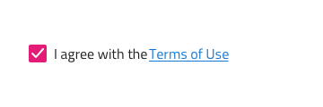
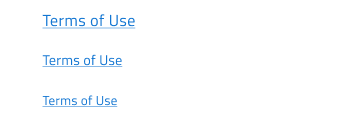
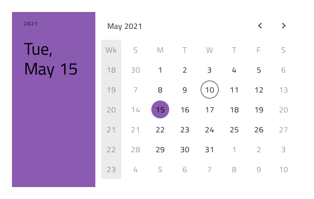
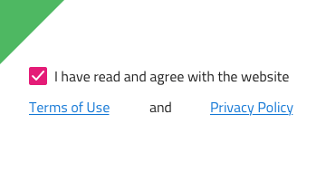
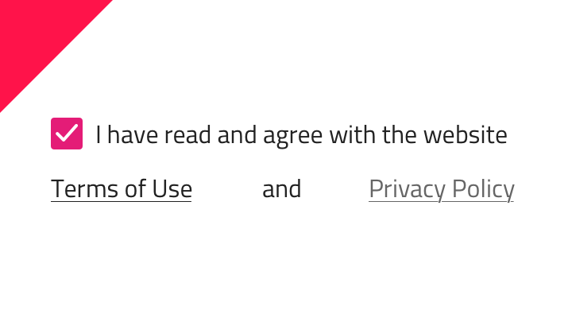

## Hyperlink

Use the Hyperlink Component to allow the user access additional information related to a styled piece of text in a paragraph like the mentioning of the Terms of Use or the Privacy Policy in a form.

### Hyperlink Demo



### Size

The Hyperlink comes in two different sizes matching the available sizes for paragraph text: a 16pt Body 1 and a 14pt Body 2.



### Styling

The Hyperlink can be styled through the Styling library by changing its default blue color to another one.



## Usage

Always choose a Hyperlink text color that makes it stand out in a paragraph. Avoid using the same color or similar nuances of it and pick a consistent color across your complete design.

| Do                                                                                   | Don't                                                                                    |
| ------------------------------------------------------------------------------------ | ---------------------------------------------------------------------------------------- |
|  |  |

## Code Generation

When colors or fonts are specified for the Hyperlink, they are applied directly to a CSS class that is applied to the hyperlink element.

> [!WARNING]
> Triggering `Detach from Symbol` on an instance of the Hyperlink in your design is very likely to result in loss of code generation capability for the Hyperlink.

### Data Bindings

Data bindings are specified by using curly brace syntax, example: {isAdmin}. Data bindings can be non-nested or nested. If the target property is a nested property, include the nested property chain, but don’t include the model object name. Examples:

#### Not Nested

```typescript
Customer {
  imageName: String;
}
```

DataProperty would be: `{imageName}`

#### Nested

```typescript
Profile {
  imageName: String;
}

Customer {
  profile: Profile;
}
```

DataProperty would be: `{profile.imageName}`

### Event Property

When supplied, this property is used to create a method in the component TypeScript and add an Angular click signature in the HTML. When supplied the event must be specified using the curly braces format: {onEventName}.

### LinkURL

The LinkURL accepts a URL or a binding. When supplied these values will be assigned to the href property on the HTML control.

- Example URL: http://www.infragistics.com
- Example binding: {companyWebsite}

### Text

The Text property may contain text, binding, or a combination of the two, examples:

- Settings
- {settingsLabel}
- Important {labelText}

When supplied the Text property is used to fill in the text to display for the Hyperlink.

## Additional Resources

Related topics:

- [Form Pattern](../patterns/form.md)
  <div class="divider--half"></div>

Our community is active and always welcoming to new ideas.

- [Indigo Design **GitHub**](https://github.com/IgniteUI/design-system-docfx)
