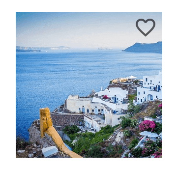
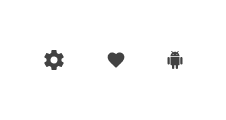

# Icon

Use the Icon Component to provide subtle graphical information to the user that, in some cases, may also trigger simple interactions such as liking a product, saving an article for later, etc. You may choose between the already provided [Material Icons](../style/material-icons.md) or add the ones you need to the `Icons` page in Figma or `🎨 Material Icons` page in Sketch in the **Indigo.Design System** and the only condition here to use your icon is that it needs to be a component or symbol. We highly recommend exercising caution when selecting icons to add to the kit. It is important to maintain consistency in order to ensure the best visual coherence between them. The Icon is visually identical to the [Ignite UI for Angular Icon Component](https://www.infragistics.com/products/ignite-ui-angular/angular/components/icon.html)

## Icon Demo

## Size

The Icon comes in three different sizes:

- Large
- Medium
- Small

## Styling

The Icon comes with styling flexibility through the options for selectable graphic and the color applied to it.

## Usage

Carefully pick the Icon color to assure good contrast with the background and definitely avoid similar shades of the same color or combinations that create chromatic aberrations.

| Do                          | Don't                         |
| --------------------------- | ----------------------------- |
|  |  |

## Additional Resources

Related topics:

- [Material Icons](../style/material-icons.md)
- [Bottom Navigation](bottom-nav.md)
- [Card](card.md)
- [Navbar](navbar.md)
- [Navigation Drawer](nav-drawer.md)
- [Tabs](tabs.md)
  

Our community is active and always welcoming to new ideas.

