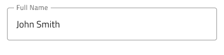
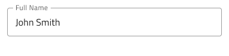
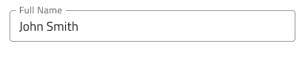
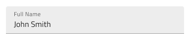
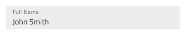
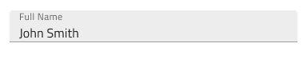
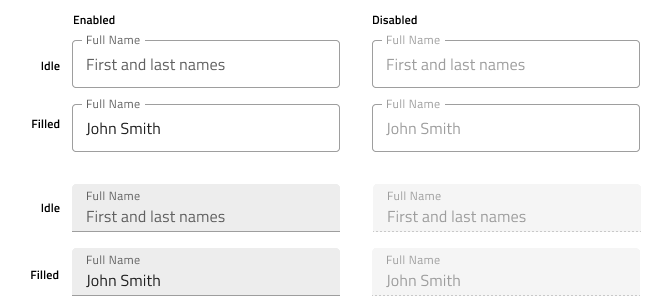
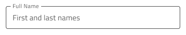
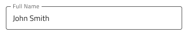
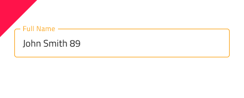

# Input

Use the Input component to collect user data such as strings, numbers fitting various contexts, dates, and other values, such as emails and passwords. Multiple inputs can be combined to craft easy-to-use and aesthetic forms. The Input is visually identical to the [Ignite UI for Angular Input Group Component](https://www.infragistics.com/products/ignite-ui-angular/angular/components/input_group.html)

## Input Demo

## Types

In Figma we offer a choice between a simple input with or without a hint (boolean property), and a searchbar.

`simple`

`hint`

`searchbar`

 In Figma we offer choice between two distinct types: border style for a more structured perception on solid color backgrounds and boxed style which is most appropriate when the Input is placed on top of a vivid image to improve the readability of its content.

`border`

`box`

## Size

The Input comes in three different sizes:

- Large
- Medium
- Small

## Interaction State

In Figma, the Input is in an Enabled state by default and can be switched to a Disabled state from the properties panel on the right.

## State

The Input component goes through different states as the user interacts with it: **Idle**, which displays the placeholder in the place of the content; **Idle & Hover**, indicating that the input is active when the user hovers over it; **Filled**, which appears after the user has entered content and moved on from the input; **Filled & Hover**, indicating that the input is active when the user hovers over it, after the content has been entered; and **Focused**, which provides a visual cue that the user is actively typing in the input.

`idle`

`idle & hover`

`filled`

`filled & hover`

`focused`

Every experienced designer uses constraints wisely to limit the user input and avoid invalid states, hence the availability of validation styles. Through the available validation styles, the Input is equipped for sophisticated designs that display Success, Warn, and Error visuals.

`success`

`warn`

`error`

In Figma you can switch between states and validation states using the "State" property in the properties panel on the right. 

## Layout

The Input has rich support for Prefix and Suffix through a combination of text and icons that can, in certain cases, reduce the input effort for the user: e.g. an @email.com Suffix means both fewer keystrokes and more clarity of expected content. In Figma, removing the Prefix or Suffix can be achieved in the properties panel by switching them on or off.

## Content Type

Each Input component includes a `Content Type` layer that specifies the type of information being inserted, such as text, email, password, phone number, number, or date. After entering data into the input field, it's important to set the `Content Type` accordingly to ensure that your design is correctly parsed into App Builder.

## Styling

The Input comes with styling flexibility through the colors of its background and border/bottom line, as well as icon color and text styles of its prefix, suffix, and main areas of content. To change the validation styles, it is recommended to update the respective color variables in the Indigo.Design library. 

## Usage

Use the box type of Input when placing forms on top of an image to improve readability. 
Use only one of the types within a form. Do not use both types.
When using an Input in warn or error state in your designs, choose a preset with helper text and use the opportunity to provide guidance to the user.

| Do                                                                           | Don't                                                                            |
| ---------------------------------------------------------------------------- | -------------------------------------------------------------------------------- |
|  |  |
|  |  |
|  |  |

## Additional Resources

Related topics:

- [Combo](combo.md)
- [Select](select.md)
- [Form Pattern](../patterns/form.md)
- [User Profile Pattern](../patterns/user-profile.md)
  

Our community is active and always welcoming to new ideas.
