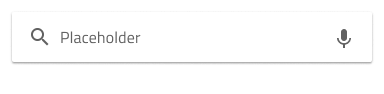
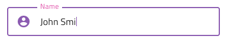

# Input

Use the Input component to collect user data such as strings, numbers fitting various contexts, dates, and other values, such as emails and passwords. Multiple inputs can be combined to craft easy-to-use and aesthetic forms. The Input is visually identical to the [Ignite UI for Angular Input Group Component](https://www.infragistics.com/products/ignite-ui-angular/angular/components/input_group.html)

## Input Demo

## Types

The Input Component can utilize the function of a input text field, where the user inserts information related to the specific case in order to complete a task or a searchbar. While in Figma you can pick either a simple input or a searchbar, in Adobe XD and Sketch, the Input lets you choose a preset from three options: simple input, hint which is an input with a helper text, and searchbar. In Figma, the hint option is perceived as a property, not a separate input type.

The hint and simple presets (considered the same input type in Figma) offer choice between two distinct types: border style for a more structured perception on solid color backgrounds, and boxed style which is most appropriate when the Input is placed on top of a vivid image to improve the readability of its content.

## Enabled and Disabled States

In Sketch and Adobe Xd, each of these presets can be inserted in an enabled or disabled state. In Figma on the other hand, by default the input types are always enabled and they can be switched to disable state form the property panel. 

## States

When the user interacts with the Input, it goes through various states: **Idle** with a placeholder in the place of the content,**Hover** which indicates once the user place the cursur over the input, that the input is enabled and the user can interact with it, **Filled** that shows once the user has finished adding content and moved on, **Focused** with a visual indication that the user is currently inserting a value. 

Every experienced designer uses constraints wisely to limit the user input and avoid invalid states, hence the availability of validation styles. Through the available validation styles, the Input is equipped for sophisticated designs that display success, warning, and error visuals.

In Sketch, the states and validation states are achieved with `Symbol Overrides`, while in Figma and Adobe XD we are using the `Component States` paradigm to let you easily switch between them.

## Layout

The Input has rich support for prefix and suffix through a combination of text and icons that can, in certain cases, reduce the input effort for the user: e.g. an @email.com suffix means both fewer keystrokes and more clarity of expected content.In Figma, removing either the prefix or the suffix can be achieved from the property panel by switching them on and off. In Sketch, to remove the prefix or suffix simply set their override to ~No Symbol, and the smart layout rules will adjust the input accordingly. In Adobe XD, the same can be achieved by deleting the unnecessary prefix or suffix layer and the Stack will take care to adjust the layout accordingly.

## Styling

The Input comes with styling flexibility through the colors of its background and border/bottom line, as well as icon color and text styles of its prefix, suffix, and main areas of content. To change the validation styles, it is recommended to update the respective color variables in the Indigo.Design library. 

## Usage

Use the box type of Input when placing forms on top of an image to improve readability. When using an Input in warning or error state in your designs, choose a preset with helper text and use the opportunity to provide guidance to the user.

| Do                                                                           | Don't                                                                            |
| ---------------------------------------------------------------------------- | -------------------------------------------------------------------------------- |
|  |  |
|  |  |

## Additional Resources

Related topics:

- [Combo](combo.md)
- [Select](select.md)
- [Form Pattern](../patterns/form.md)
- [User Profile Pattern](../patterns/user-profile.md)
  

Our community is active and always welcoming to new ideas.
