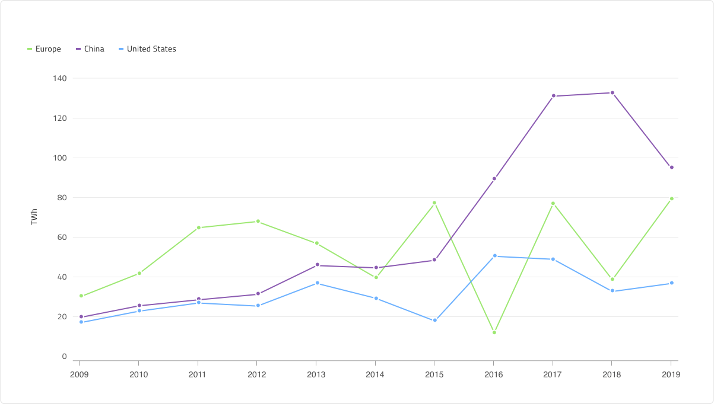
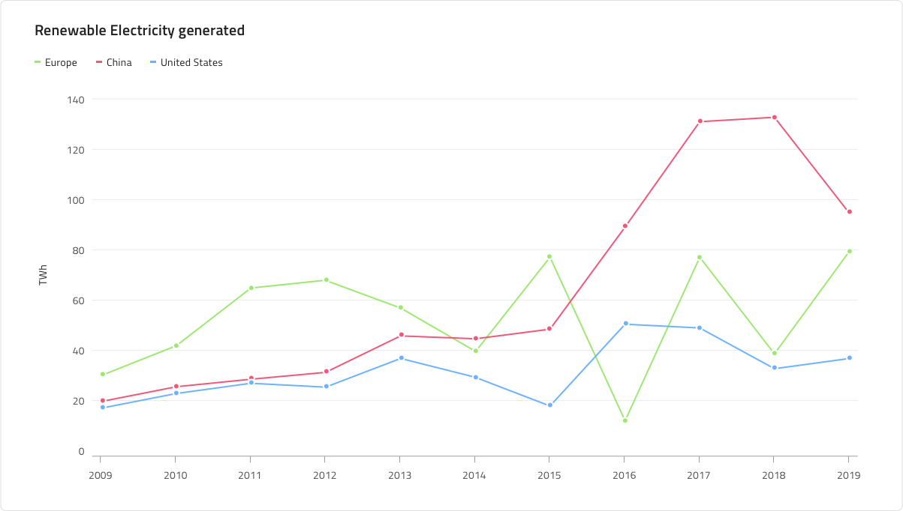
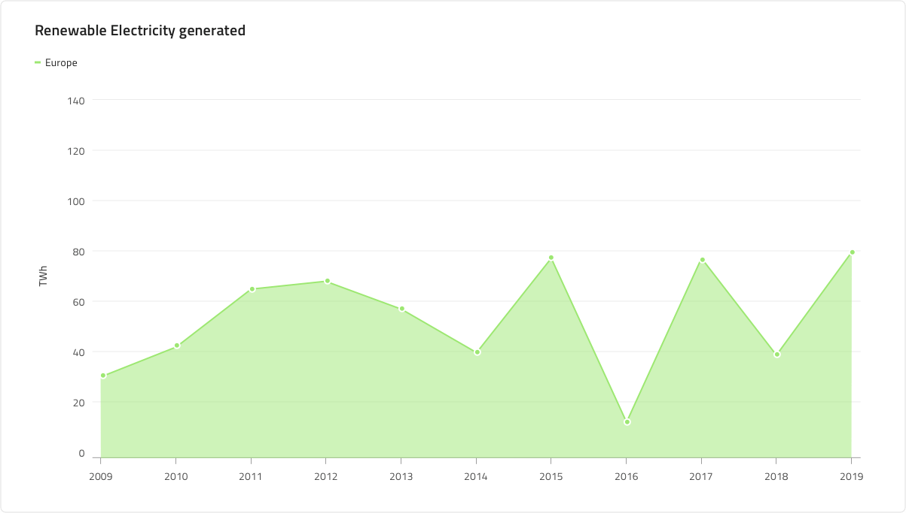

# Line Chart

 A Line Chart is a type of category line graph that shows the continuous data values represented by points connected by straight line segments of one or more quantities over a period of time. It’s often used to show trends and perform comparative analysis. The Y-Axis (labels on left side) show a numeric value, while the X-Axis (bottom labels) show a time-series or comparison category. You can include one or more data sets to compare, which would render as multiple lines in the chart. The Line Chart is identical to the Spline Chart in all aspects except that the line connecting data points does not have spline interpolation and smoothing for improved presentation of data.

## Line Chart Demo

The Line Chart has Title, Legend and a Chart Area, which can be changed between two states - Idle and Hover, and where you can also change the Chart Type - Line or Area, and its Series Amount. Individual series of the legend can also be turned off by setting them to No Symbol. Their color and symbol - rectangle, line or dot, can also be changed individually.

## Title

The Line Chart has a title that can be changed or hidden if not needed. 

## Legend

The Legend can also be hidden and it stands for the number of the series in the chart and what they represent. Also the number of the series can be changed by adding series, or with setting a serie to No Symbol, hiding series.

## Chart Type

This is where the chart can be switched between Line and Line Area Chart. The Area Chart is the same as the Line, but the area between the X axis and the line itself is filled in the series's color. The area chart is used best to represent how big of a change there is and what the trend is over time.

## State

The Line Chart has two states - Idle and Hover. In the Hover state tooltip is shown upon hovering over a data point.

## Y-Axis

The Y-axis of the Line chart comprises of a Title, Labels and an Axis. The title and the labels can be changed or hidden. To hide the title just type a Spacebar in its field and to hide a label set its override to ~No Symbol. Changing the Axis' color from the default transparent color will show it if needed. And to hide all of the Y-axis change its state to ~No Symbol.

## Gridlines

Aside from being able to change the labels, you can also change the axis' color, ticks' color and also the gridlines. The Y axis title can be changed or hidden by deleting its content.

## Line and Points

The line and points' color on the chart can be changed if it's needed so they match the color of the series.

## Series Amount

This override provides flexibility to select between one, two and **three** series that will be rendered. They can also be changed for the Line Area Chart type.

## Styling

The Line and Area Line Chart's color of the series, dots and area can be easily changed and also border and background color.

## Usage

Use the Line Chart when you have a continuous data set and want to see the amount of change over a period of time. If you use time to represent the change in the category you should always set it on the horizontal axis. Always start the Y-Axis at 0 so data comparison is accurate and order time-series data from left to right. Use proper aspect ratio to minimize dramatic slope drops. When there are more than one serie in the chart it is best they be different colors to be distinguishable. It is also good to have a legend signifying the different colors in the series and what they represent.

 | Do                                                                                             | Don't                                                                                              |
| ---------------------------------------------------------------------------------------------- | -------------------------------------------------------------------------------------------------- |
|  |  | 

## Additional Resources

Related topic:

- [Spline Chart](../spline-chart.md)
  

- [Column Chart](../column-chart.md)
  

Our community is active and always welcoming to new ideas.

