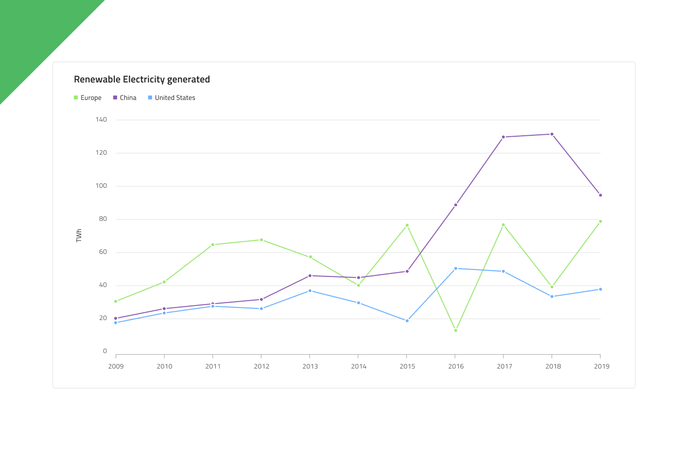

# Line Chart

 A Line Chart is a type of category line graph that shows the continuous data values represented by points connected by straight line segments of one or more quantities over a period of time. It’s often used to show trends and perform comparative analysis. The Y-Axis (labels on the left side) shows numeric values, while the X-Axis (labels at the bottom) shows a time-series or comparison category. You can include one or more data sets to compare, which would render as multiple lines in the chart. The Line Chart is identical to the [Spline Chart](spline-chart.md) in all aspects except that the line connecting data points does not have spline interpolation and smoothing for improved presentation of data. The Line Chart is visually identical to the [Ignite UI for Angular Line Chart Component](https://www.infragistics.com/products/ignite-ui-angular/angular/components/charts/types/line-chart.html)

## Line Chart Demo

The Line Chart has Title, Legend, and Chart Area, where you may choose between Idle and Hover states. It also supports two chart types: Line and Area with a number of Series Amount configurations and allows to adjust the Legend accordingly.

## Title

The Line Chart has a title that can be changed or hidden if not needed. In Figma you can hide the title by switching off the `Title` boolean property and thanks to the auto layout feature, the chart's layout will adjust itself accordingly.

## Legend

The Line Chart comes with a Legend to show the number of series in it and what they represent. The Legend in Figma is built using auto layout, meaning you can show/hide series items from the layers panel and the content will adjust itself accordingly. You can also fully hide it by switching off the boolean property `Legend`. Legend items' shape is also configurable via the `Icon Type` property of the Series and can be set to Square, Circle or Line.

## Chart Type

The Chart Type allows switching between **Line** and **Area**, from the `Area Fill` boolean property. The latter one has the area between the X-axis and the line filled with the series' color. Area charts are used to represent how big of a change there is and what the trend is over time.

## State

The Line Chart has two states - Idle and Hover. In Figma you can switch between the two states by selecting the nested Chart Area component from the layers panel and switching on/off the boolean property `Hover Tooltip` from the properties panel. In the Hover state a tooltip, giving information about the series' values at this point, is shown upon hovering over a data point.

## Y-Axis

The Y-axis of the Line Chart comprises of a Title, Labels, and the Axis itself. The Title and the Labels are configurable and to hide a label simply hide it from the layers panel in Figma. By default, the Y-axis is hidden in Figma. To make it visible go to the layers panel, find the Y-axis line and show it. If you want to hide all elements at once, hide the nested Y-axis component from the layers panel in Figma.

## Gridlines

The Line Chart has built-in Gridlines to make it easier to visually trace a data point to a value on the Y-axis. In Figma you can show/hide them by selecting the nested Chart Type component and switching on/off the boolean property `Gridlines` from the properties panel.

## Series Amount

The Line Chart comes with a selection of **one**, **two**, and **three** (by default) series that will be rendered in the Chart Area. This is also valid for the Area type. You can show/hide as many series as you need by selecting the nested Chart Type component in the layers panel and switching on/off the boolean properties for the series and the series markers (e.g. `Series 3` and `Series 3 Markers`). You should also adjust the series appropriately in the legend by showing/hiding them from the layers panel.

## Styling

First and foremost, the Line Chart lets you change the color of the series. It is recommended to use only colors from the palette for data visualizations with nuances named series.1, series.2 and so on till series.10. You may also change the colors of the vertical and horizontal axis, the gridlines, as well as the chart area background and border colors. Titles, labels, annotation values etc. are also customizable via the available text styles in the **Indigo.Design System**.

## Usage

Use the Line Chart when you have a continuous data set and want to see the amount of change over a period of time. If you use time to represent the change in the category you should always set it on the horizontal axis. Always start the Y-Axis at 0 so data comparison is accurate and order time-series data from left to right. Use proper aspect ratio to minimize dramatic slope drops. When there is more than one series in the chart they should use different colors to be distinguishable. Using a legend to signify what they represent is considered to be best practice.

 | Do                                                                                             | Don't                                                                                              |
| ---------------------------------------------------------------------------------------------- | -------------------------------------------------------------------------------------------------- |
|  |  | 

## Additional Resources

Related topics:

- [Spline Chart](spline-chart.md)
- [Step Chart](step-chart.md)
- [Column Chart](column-chart.md)
- [Pie Chart](pie-chart.md)
- [Skeleton Charts](skeleton-charts.md)

Our community is active and always welcoming to new ideas.
