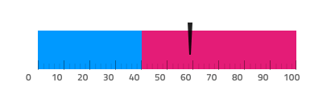

# Linear Gauge

Use the Linear Gauge Component as a data visualization that displays a value within context depicted by color-coded ranges underneath. The Linear Gauge is visually identical to the [Ignite UI for Angular Linear Gauge Component](https://www.infragistics.com/products/ignite-ui-angular/angular/components/lineargauge.html)

For scenarios where a target value is critically important for understanding and interpreting the information, you should use the [Bullet Graph](bullet-graph.md) instead.

## Linear Gauge Demo

## Title, Subtitle and Legend

The Linear Gauge has a Title, Subtitle and a Legend. The Title and Subtitle's text can be changed and the legend changes depending on Series Amount chosen. They can also be hidden if they are not needed.

## Tooltip

The Bullet Graph comes with an override for the tooltip visibility: **Tooltip Off** hides it and Tooltip On shows it on top of the series.

## Needle Type

The Linear Gauge provides various overrides that control the shape of the needle, which indicates the current value: **wide triangle**, needle, trapezoid, and triangle.

## Ranges Amount

The Linear Gauge comes with three preset range configurations: two, **three**, and four ranges.

## Styling

The Linear Gauge comes with styling flexibility through the various overrides controlling the range of brushes including: Needle Brush, Tick Brush, Minor Tick Brush, and a collection of Range Brushes.

## Usage

When creating data visualizations and information dashboards pick carefully between Bullet Graph and Linear Gauge depending on whether your scenario has a target value or not, and between Linear and Radial Gauge based on the amount of screen space you have at hand. Keep in mind that both Graphs and Gauges only show the current value and have no way to display historical values, if your application scenario requires such display, you should consider using the Line or Column chart.
To create an easy to the eye and crisp data visualization pick colors for the Needle that have good contrast with the ranges and background underneath, avoid using variants of the same color as this makes the visualization hard to read and interpret. Unlike the [Radial Gauge](radial-gauge.md), the Linear Gauge Component needs more empty space around and you should avoid laying out a collection of Linear Gauges too densely next to one another as this makes them hard to comprehend.

| Do                                                                                         | Don't                                                                                          |
| ------------------------------------------------------------------------------------------ | ---------------------------------------------------------------------------------------------- |
|  |  |
|  |  |

## Additional Resources

Related topics:

- [Bullet Graph](bullet-graph.md)
- [Category Chart](chart-category.md)
- [Radial Gauge](radial-gauge.md)
- [Data Binding](../codegen/data-binding.md)
  

Our community is active and always welcoming to new ideas.

