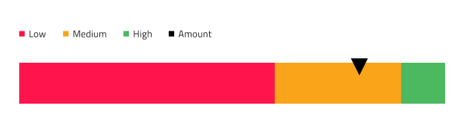

# Linear Gauge

Use the Linear Gauge Component as a data visualization that displays a value within context depicted by color-coded ranges underneath. The Linear Gauge is visually identical to the [Ignite UI for Angular Linear Gauge Component](https://www.infragistics.com/products/ignite-ui-angular/angular/components/lineargauge.html)

For scenarios where a target value is critically important for understanding and interpreting the information, you should use the [Bullet Graph](bullet-graph.md) instead.

## Linear Gauge Demo

## Title and Subtitle

The Linear Gauge has a Title and Subtitle which text can be changed. In Figma you can toggle on and off the Title and Subtitle layers visibility in the Layers panel. 

## Legend

The Linear Gauge comes with a Legend that can be adjusted accordingly to match the ranges shown on it and the current value. In Figma you can toggle on and off the `Legend` instance visibility in the Layers panel.  Additionally, for each `Serie` instance you can change the icon type between Square, Line, or Circle.

## Tooltip

The Linear Gauge comes with a tooltip that may be hidden by toggling off the `Tooltip` instance from the Layers panel in Figma.

## Needle Type

The Linear Gauge provides various overrides that control the shape of the needle, which indicates the current value: Wide Triangle, Needle, Trapezoid, and Triangle. In Figma, you can select the shape of the needle by selecting the `Needle Type` instance and then choosing the type from the right sidebar.

## Ranges Amount

The Linear Gauge comes with three preset range configurations: two, three, and four ranges.In Figma you can change the Series amount using the `Series Amount` property in the properties panel.

## Ticks and Values

Ticks and Values are also configurable. The two types of ticks: Ticks and Minor Ticks can be hidden by setting their color to `Transparent`. The default Values 0,10,20 etc. up to 100 can be adjusted according to one's needs.

## Styling

The Linear Gauge comes with styling flexibility through the various options for brushes including Value Brush, Target Value Brush, Tick Brush, Minor Tick Brush, and a collection of Range Brushes.

## Usage

When creating data visualizations and information dashboards pick carefully between Bullet Graph and Linear Gauge depending on whether your scenario has a target value or not, and between Linear and Radial Gauge based on the amount of screen space you have at hand. Keep in mind that both Graphs and Gauges only show the current value and have no way to display historical values, if your application scenario requires such display, you should consider using the Line or Column chart.
To create an easy on the eye and crisp data visualization pick colors for the Needle that have good contrast with the ranges and background underneath, avoid using variants of the same color as this makes the visualization hard to read and interpret. Unlike the [Radial Gauge](radial-gauge.md), the Linear Gauge Component needs more empty space around and you should avoid laying out a collection of Linear Gauges too densely next to one another as this makes them hard to comprehend.

| Do                                                                                 | Don't                                                                                  |
| ---------------------------------------------------------------------------------- | -------------------------------------------------------------------------------------- |
|  |  |
|  |  |

## Additional Resources

Related topics:

- [Radial Gauge](radial-gauge.md)
- [Bullet Graph](bullet-graph.md)
- [Line Chart](line-chart.md)
- [Column Chart](column-chart.md)

Our community is active and always welcoming to new ideas.
